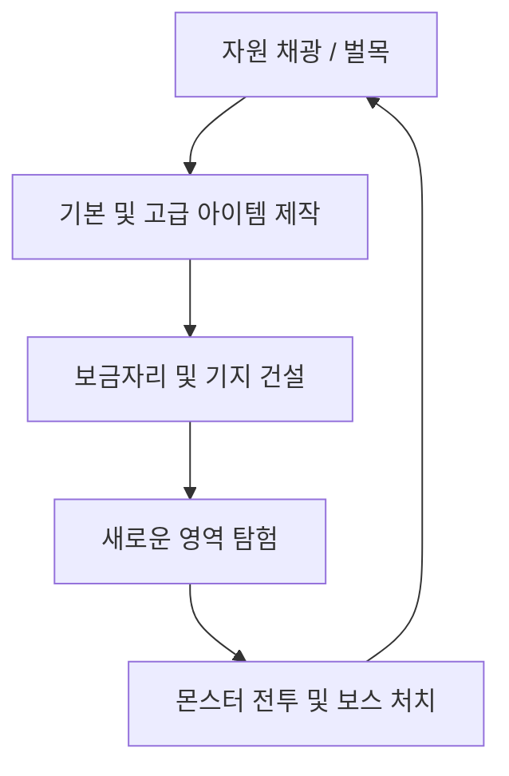

# 탑다운 크래프팅 게임 기획서 & 개발 가이드 (Game Design Document)

> [!IMPORTANT]
> **이 프로젝트에서 작업을 수행하는 AI 어시스턴트는 반드시 이 문서의 [1. AI 개발 가이드라인]을 가장 먼저 읽고 핵심 규칙을 준수해야 합니다.**

---

## 1. AI 개발 가이드라인 (AI Guidelines)

이 프로젝트에서 작업을 수행하는 AI 어시스턴트는 반드시 워크스페이스 루트의 **[AGENTS.md](./AGENTS.md)**에 명시된 규칙과 가이드라인을 가장 먼저 읽고 완벽하게 준수해야 합니다. 

핵심 내용은 다음과 같습니다:
- **작업 범위**: `RootDesk/MyDesk/` 폴더 하위 스크립트, 데이터셋, 모델 작성만 수행. `Environment/` 및 자동 생성 파일 수정 금지.
- **물리 컴포넌트**: 모든 동적 엔티티는 중력이 없는 `KinematicbodyComponent` 필수 사용.
- **하드코딩 금지 및 모듈화**: 유사 로직 필요 시 하드코딩하지 말고 데이터셋, 스트럭트, 컴포넌트 생성을 최우선 시도. 하드코딩이 불가피할 경우 진행 전 반드시 유저 승인 획득.
- **연동 검증**: `msw-maker-mcp`를 통한 `refresh` 및 런타임 로그 상호작용 검증 의무화.

---

## 2. 핵심 게임 루프 (Core Game Loop)

1. **채집 (Gathering)**: 맵 상의 다양한 타일(흙, 돌, 광석 등)과 오브젝트(나무)를 파괴하여 자원을 획득합니다.
2. **제작 (Crafting)**: 획득한 자원으로 도구(곡괭이, 도끼), 무기, 횃불, 건축용 타일 등을 제작합니다.
3. **건설 (Building)**: 타일을 설치해 벽을 세우고 방을 만들어 자신만의 기지를 구축합니다.
4. **전투 (Combat)**: 지하와 어둠 속에서 스폰되는 다양한 몬스터와 보스에 맞서 싸우고 새로운 고유 자원을 획득합니다.
5. **교역 (Trading)**: 희귀 드롭 아이템과 상위 장비를 다른 유저와 거래하며 경제 생태계에 참여합니다. (장기 목표)

### 2.1. 장르 포지셔닝 & 디자인 필러 (Genre Positioning & Design Pillars)

**레퍼런스 장르**: 마인크래프트, 스타듀밸리, 코어키퍼, 테라리아와 같은 **샌드박스형 크래프트 게임**. 탑다운 시점(코어키퍼에 가장 근접)에서 채집→제작→건설→탐험→전투→교역의 무한 순환을 제공한다.

| 필러 | 의미 | 적용 원칙 |
|---|---|---|
| **영속적인 나만의 세계** | 내가 만든 것, 모은 것이 게임을 꺼도 그대로 남는다 | 모든 플레이어/월드 상태는 DataStorage에 영속화 (§3.6) |
| **살아있는 월드** | 캐낸 자원은 시간이 지나면 되살아나고, 세계는 멈추지 않는다 | 자원 6시간 리스폰 + 점유 영역 보호 (§3.7) |
| **노력의 보상** | 더 깊이 탐험하고 더 좋은 도구를 만들수록 더 희귀한 보상 | 테크 트리(§4) + 희귀도 등급(§3.8) |
| **함께하는 경제** | 희귀한 전리품은 자랑하고, 남는 것은 거래한다 | 유저 간 거래/마켓 (§3.9) |
| **즉각적인 피드백** | 모든 행동에는 보고 듣는 반응이 따른다 | 타격감/실패 리액션/획득 연출 (§3.2, §3.5) |

---

## 3. 핵심 시스템 명세 (Core Systems Specification)

### 3.1. 플레이어 이동 및 조작
- **조작 방식**: 방향키 이동, Alt 점프, Ctrl 공격/채광.
- **물리 컴포넌트**: `KinematicbodyComponent` 사용 (중력 없음).
  - 속도 제어: `SpeedFactor` 속성을 튜닝하여 캐릭터 이동 속도 제어.
- **카메라**: 플레이어를 추적하며 격자형 맵 탐색에 용이하도록 설정.
- **모바일 컨트롤러 지원**: [MobileController.mlua](./RootDesk/MyDesk/UI/MobileController.mlua)를 통해 모바일 디바이스 및 터치 스크린 조작 지원.
  - 가상 조이스틱 (`JoystickComponent` 연동) 및 핵심 단축키 액션 버튼 (`MINE`, `JUMP`, `BAG`, `CRAFT`, `INFO`)을 화면 크기 및 플랫폼 환경에 맞추어 동적 빌드 및 제거 처리.

### 3.2. 격자형 자원 인터랙션 (엔티티 채광 전용)
- **맵 모드**: `TileMapMode = 1` (RectTileMap).
- **좌표 변환**: 플레이어 월드 좌표 -> 타일 셀 좌표 변환 (`ToCellPosition`)으로 바라보는 방향의 인접 셀을 계산.
- **자원 채집 (Mining) — 엔티티 전용**:
  - ⚠️ **타일 파괴(`RemoveTile`) 기반 채광은 폐기됨.** 지반/풀밭 타일맵은 순수 배경이며, 모든 채집 가능한 자원은 **독립 엔티티**(Stone, Big Stone, Tree, GrownGrass 등)로만 스폰됨.
  - 흐름: `PlayerController:RequestMine` → `ResourceSpawner.GridToEntity`에서 대상 셀의 자원 엔티티 조회 → `TileDurabilityManager:HitResource(map, pivotKey)`로 피격 전달.
  - 내구도: 자원별 피격 횟수 관리 (Stone 2회, Tree 3회, Big Stone 4회, GrownGrass 1회). 10초간 미피격 시 내구도 자동 회복.
  - 파괴 시 드롭: `ItemDropLogic`(`ItemDropDataSet.csv` 기반 드롭 테이블)에서 소스 엔티티 이름(`SourceId`)으로 드롭 아이템/수량/확률을 조회하고, `item_dataset`에서 모델 정보를 찾아 아이템 엔티티를 스폰.
- **블록 설치 (Building)**:
  - 인벤토리에서 타일을 선택하고 빈 격자를 우클릭 시 설치.
  - `RectTileMapComponent:SetTile(tileName, cellPos)`를 통해 실시간으로 타일 배치. (향후 구현)
- **채집 실패 시각 리액션 (Harvest-Fail Reaction)**:
  - **목적**: 자원을 타격했지만 채집이 불가능한 경우(요구 도구 미장착, 도구 등급(Tech Lock) 미달 등), 플레이어가 "왜 안 캐지는지"를 즉시 인지할 수 있도록 명확한 시각 피드백 제공.
  - **판정 주체**: `TileDurabilityManager:HitResource`가 데미지 계산 시점에 채집 가능 여부를 판정. 데미지가 0이 되는 모든 케이스(등급 미달 등)는 "실패 타격"으로 분류.
  - **연출 (성공 타격과 명확히 구분)**:
    - **거부 흔들림(Refusal Shake)**: 기존 피격 흔들림(`ResourceReaction.mlua`의 Hit Shake)과 동일한 애니메이션 파이프라인을 재사용하되, **좌우로 짧게 "도리도리" 하는 별도 패턴**(진폭↓, 주기↑, 회전 없음)으로 차별화. 자원이 "거부"하는 느낌의 단일 애니메이션.
    - **색상 플래시 부재**: 성공 타격의 피격 플래시·파티클은 출력하지 않음 (내구도 변화 없음을 시각적으로 일치).
    - **(선택) 안내 말풍선**: 동일 자원에 실패 타격이 2회 이상 반복되면 1회에 한해 요구 도구 안내 말풍선 출력 (예: "곡괭이가 필요합니다"). 스팸 방지를 위해 자원당 쿨다운(예: 10초) 적용.
  - **데이터 주도 설계**: 실패 판정 기준은 기존 `ResourceDataSet`(RequiredToolType)과 `item_dataset`(ToolType/ToolPower)을 그대로 사용하며, 거부 흔들림의 진폭/주기/쿨다운 등 연출 파라미터는 `ResourceReaction` 컴포넌트 프로퍼티로 노출해 하드코딩 없이 튜닝 가능하게 한다.
  - **전달 경로**: 서버(`HitResource`) 판정 → 실패 시 클라이언트로 실패 이벤트 전파(Multicast 또는 대상 Client RPC) → 해당 자원 엔티티의 `ResourceReaction`이 거부 흔들림 재생.

### 3.3. 인벤토리 및 제작 (UI)
- **인벤토리**: 캐릭터가 획득한 자원, 무기, 소비품을 보관하는 격자형 슬롯 UI.
  - MSW의 `msw-ui-system` 기반 모듈형 UI 설계.
- **제작대 (Crafting Table)**:
  - 플레이어가 제작창을 열어 보유한 자원으로 레시피에 맞춰 아이템 제작.
  - 예: 나무 5개 -> 나무 곡괭이 제작.

### 3.3.1. 캐릭터 정보(User Info) 장착 표시
- **문제**: 현재 User Info(CharacterPopup)에서 어떤 도구/장비를 장착 중인지 확인할 수 없어 UX가 불편함.
- **장비 슬롯 패널 (EquipPanel)**:
  - **무기/도구 슬롯**: 현재 `@Sync EquippedTool` 값을 기반으로 장착 아이템의 **아이콘**(`item_dataset.IconRUID`)과 **이름**을 표시. 미장착 시 빈 슬롯 프레임 + "None" 표기.
  - **스탯 연동 표기**: 장착 도구의 `ToolType` / `ToolPower`를 함께 표시 (예: "Stone Pickaxe — 곡괭이 · 효율 +2"). 채집 효율 스탯(GatheringSpeed)과 시각적으로 연결.
  - **실시간 갱신**: 장착/해제(`ServerRequestEquip` 토글) 시 `EquippedTool` 동기화에 맞춰 팝업이 열려 있으면 즉시 갱신.
  - **확장 슬롯 (예약)**: 향후 방어구/장신구 테크 도입을 대비해 Armor 슬롯 자리를 유지 (현재 비활성 표시).
- **인벤토리와의 일관성**: 인벤토리의 `[E]` 마커, 툴팁 (Equipped) 표기와 동일한 데이터 소스(`EquippedTool`)를 사용해 표시 불일치가 발생하지 않도록 한다.

### 3.3.2. 퀵 슬롯 (Quick Slot)
- **목적**: 인벤토리를 열지 않고 도구/소비 아이템을 즉시 교체·사용할 수 있는 상시 노출 HUD 슬롯 바.
- **구성**:
  - **슬롯 수**: 4칸 (확장 고려해 데이터로 관리). 화면 하단 중앙에 가로 배치 (모바일에서는 액션 버튼 패드와 겹치지 않게 배치 조정).
  - **슬롯 표시 요소**: 아이템 아이콘(`IconRUID`), 보유 수량, 슬롯 번호(1~4), 장착 중 하이라이트 테두리.
- **등록/해제**:
  - 인벤토리에서 아이템 슬롯을 **드래그하여 퀵 슬롯에 드롭**(PC) 또는 아이템 선택 후 "퀵 슬롯 등록" 버튼(모바일 대체 UX).
  - 퀵 슬롯에 등록된 항목은 아이템 **종류 참조**(이름 기반)로 저장 — 수량이 0이 되면 회색 처리(슬롯 유지), 재획득 시 자동 복구.
- **사용**:
  - **PC**: 숫자키 `1`~`4`로 해당 슬롯 발동. 도구류(`Category=tool`)는 장착 토글(`ServerRequestEquip` 재사용), 설치물/소비품은 사용 동작으로 분기.
  - **모바일**: 슬롯 터치로 동일 동작.
- **동기화/저장**:
  - 퀵 슬롯 구성은 플레이어별 데이터로 관리 (`PlayerInventory`에 `@TargetUserSync` 퀵 슬롯 테이블). 차후 DataStorage 영속화와 연계.
- **데이터 주도 설계**: 슬롯 수, 키 바인딩, 슬롯별 동작 분기(장착/사용)는 하드코딩하지 않고 `item_dataset.Category` 기반으로 분기 처리.

### 3.4. 전투 및 몬스터 AI
- **몬스터 스폰**: 어두운 영역이나 특정 타일 근처에서 주기적으로 몬스터 스폰 (`MonsterSpawner`).
- **몬스터 AI**: `KinematicbodyComponent`를 활용한 배회 AI (`MonsterWanderAI`) 및 플레이어 추적 AI 구현.
- **전투**:
  - 플레이어가 무기를 휘둘러 피격 판정 범위 내의 몬스터에게 데미지 부여.
  - 체력(HP) 컴포넌트 및 피격 애니메이션(주황색 깜빡임 등) 적용.

---

### 3.5. 시드 기반 맵 생성 및 하이브리드 구조 (Seed-based Generation & Hybrid Structure)
- **하이브리드 맵 구조**:
  - **지형 (TileMap)**: 지반 타일(Layer 1 - `BaseEarth`) 및 풀밭 지형(Layer 2 - `BaseGrass`)은 static 타일맵으로 렌더링 성능을 최적화.
  - **상호작용 자원 (Entity)**: 나무(Wood), 석돌(Stone), 구리/철 광석(Copper/Iron Ore) 및 상자 등은 독립적인 엔티티(`Entity`)로 스폰.
  - **오브젝트 연출**: 자원 엔티티에 피격 물리 흔들림 액션, 가공 파티클 연출, 투명도 변화(플레이어가 가릴 시 Z-Sorting 처리)를 구현해 완성도 높은 타격감 제공.
- **시드 기반 절차적 월드 생성**:
  - 사용자 지정 시드 값에 대응하는 의사난수 생성기(PRNG) 구축.
  - Perlin/Simplex Noise 알고리즘을 탑재하여 시드에 따라 자연스러운 대륙 형태와 자원 밀도 맵을 100% 동일하게 복원 가능하게 제어.

---

### 3.6. 유저 데이터 영속화 (Persistence)

> **원칙: 게임을 종료해도 유저의 모든 진행 상태는 유지된다.** 영속화되지 않는 신규 상태를 추가하는 것은 기획 위반으로 간주한다.

- **저장 매체**: MSW **DataStorage** (`_DataStorageService`). 서버 권위(Server-Authoritative)로만 읽기/쓰기 수행.
- **영속화 대상**:
  - **플레이어 데이터** (UserId 키): 인벤토리 전체, 장착 도구(`EquippedTool`), 퀵 슬롯 구성, 레벨/XP/스태미나, 마지막 위치, (향후) 화폐 잔액·도감 진척.
  - **월드 데이터** (월드/셀 키): 유저가 설치한 건축물·가구(종류/셀 좌표/소유자), 상자(Wooden Chest) 보관 내용물, 자원 채집 상태(파괴 시각 타임스탬프 — §3.7 리스폰 계산의 근거).
- **저장 전략 — 캐시 → 더티 체크 → 디바운스 플러시**:
  - 런타임 상태는 메모리 캐시로 관리하고, 변경 시 더티 플래그만 기록. 루프/타이머 내 직접 Set/Get 호출 금지.
  - **플러시 시점**: ① 주기 저장(60초 간격), ② 플레이어 퇴장(`OnPlayerLeave`) 시 즉시 저장, ③ 중요 이벤트(제작 완료, 거래 성사, 건축 설치/철거) 직후 우선 저장.
- **스키마 버전 관리**: 저장 데이터에 `schemaVersion` 필드를 포함하고, 로드 시 버전별 마이그레이션 함수를 통과시켜 업데이트로 인한 세이브 호환성 파손을 방지.
- **장애 대응**: 로드 실패 시 신규 유저 초기값으로 시작하지 않고 재시도 → 실패 지속 시 안내 후 입장 차단 (데이터 유실로 인한 진행 손실이 가장 치명적인 UX이므로 보수적으로 처리).

### 3.7. 자원 리스폰 & 건축 점유 시스템 (Resource Respawn & Build Occupancy)

- **리스폰 주기**: 채집으로 파괴된 자원 엔티티는 **파괴 시점으로부터 6시간 후** 동일 셀에 리스폰된다.
  - **타임스탬프 기반 판정**: 서버 온라인 타이머가 아닌 **파괴 시각(epoch) 기록** 기반으로 판정 — 서버/세션이 내려가 있어도 경과 시간이 보존되며, 월드 로드 시 `(현재 시각 - 파괴 시각) ≥ 6h`인 셀을 일괄 리스폰 처리.
  - **주기 스캔**: 월드 가동 중에는 저빈도 스캔 타이머(예: 60초)로 만기 셀을 점진 리스폰. 동시 대량 리스폰으로 인한 프레임 스파이크를 막기 위해 틱당 처리 상한(예: 20개) 적용.
  - **리스폰 연출**: 즉시 팝업 대신 새싹→성장 완료의 짧은 스케일 업 연출로 "세계가 살아있다"는 인상 제공.
- **건축 점유 레지스트리 (Occupancy Registry)**:
  - **원칙: 유저가 건축한 구조물(벽/가구/상자/화로 등)이 점유한 셀에는 자원이 리스폰될 수 없다.**
  - 셀 키(`"x,y"`) → 점유 정보(점유 유형: 건축물/자원/예약, 소유자 UserId)의 단일 레지스트리를 서버에서 관리. 건설 시스템(§3.2 블록 설치)과 리스폰 시스템이 **동일한 레지스트리를 공유**해 충돌을 원천 차단.
  - 리스폰 판정 순서: 만기 도달 → 해당 셀 점유 조회 → **건축물 점유 시 리스폰 보류** (철거되어 점유가 해제되면 다음 스캔에서 리스폰).
  - 건축물 설치 판정에도 동일 레지스트리 사용: 자원이 서 있는 셀, 타 유저 건축물 셀에는 설치 불가.
- **데이터 주도 설계**: 리스폰 주기(기본 6h), 틱당 리스폰 상한, 연출 시간 등은 `ResourceDataSet` 확장 컬럼 또는 전역 설정 데이터셋으로 관리 — 자원 종류별 차등 주기(예: 희귀 광맥 12h)를 코드 수정 없이 튜닝 가능하게 한다.

### 3.8. 아이템 희귀도 & 전리품 시스템 (Rarity & Loot)

> 거래 경제(§3.9)가 성립하려면 "거래할 가치가 있는 물건"이 먼저 존재해야 한다. 희귀도는 그 토대다.

- **희귀도 등급**: `item_dataset`에 `Rarity` 컬럼 추가 — **Common / Uncommon / Rare / Epic / Legendary** 5등급.
  - UI 일관 표현: 등급별 색상(흰/녹/파랑/보라/주황)을 아이템 이름·슬롯 테두리·툴팁·드롭 연출에 공통 적용.
- **희귀 드롭 소스**:
  - **희귀 광맥**: 일반 자원 스폰 시 낮은 확률(예: 3%)로 희귀 변종(빛나는 광맥) 스폰 — 상위 재료 + 보너스 드롭.
  - **보스/정예 몬스터**: 고유 장비·도안(Recipe Scroll) 드롭 — 도안은 습득 시 제작 레시피 영구 해금(영속화 대상).
  - **보물 상자**: 월드 외곽 탐험 보상으로 절차 배치.
- **장비 고유성 (거래 대비)**: Rare 이상 장비는 발급 시 고유 ID(GUID)와 발급 이력(획득 경로/시각)을 부여 — 거래 추적 및 복제 검증의 기준.

### 3.9. 유저 간 거래 & 경제 (Player Trading & Economy)

> 최종 목표: **희귀 드롭 아이템과 장비를 유저끼리 사고팔 수 있는 경제**. 단계적으로 도입한다.

- **화폐 (Coin)**:
  - 단일 기축 화폐 "코인" 도입. 획득처: 몬스터 처치, 보물 상자, (향후) NPC 상점에 잡템 판매. 사용처: 유저 간 거래, NPC 상점, 수수료.
  - 잔액은 `@TargetUserSync`로 본인에게만 동기화하고 DataStorage에 영속화.
- **1단계 — NPC 상점 (경제 기반 다지기)**:
  - 기본 재료의 매입/매도 가격표를 데이터셋으로 정의 — 코인의 기준 가치 형성. MSWPackages의 상점 패키지 활용을 우선 검토.
- **2단계 — 직접 거래 (Direct Trade)**:
  - 근접한 두 유저 간 1:1 거래창. **2-Phase Confirm**(양측 제안 잠금 → 양측 최종 수락) 방식으로 한쪽 변경 시 상대 수락 자동 해제 — 거래 사기 방지의 업계 표준.
  - 서버 권위 검증: 제안 아이템의 실소유 여부, 수량, 거래 가능 플래그(`Tradable` 컬럼) 검사 후 원자적(atomic) 교환 — 부분 성공 상태가 남지 않도록 트랜잭션 처리.
- **3단계 — 마켓 보드 (비동기 거래)**:
  - 기지에 설치하는 "마켓 보드" 가구를 통해 판매 등록(아이템+가격) → 다른 유저가 오프라인 중에도 구매 가능.
  - 판매 대금은 우편함(Mailbox)으로 수령. 등록 수수료(예: 5%)로 인플레이션 억제. MSWPackages의 mail/shop 패키지 활용 검토.
- **경제 건전성 장치**:
  - **거래 로그**: 모든 거래를 서버 로그로 기록 (아이템 GUID 추적, 복제 버그 탐지 근거).
  - **거래 불가 품목**: 퀘스트/도안 등 진행 아이템은 `Tradable=false`로 차단.
  - **신규 유저 보호**: 계정 레벨 일정치(예: Lv 5) 미만 거래 제한으로 부계정 어뷰징 억제.

### 3.10. 바이옴 시스템 & 미니맵 (Biome System & Minimap)

- **바이옴 개념**: 마인크래프트의 바이옴처럼 월드를 성격이 다른 지역으로 구분한다. 단, 바이옴 **배치는 절차 생성이 아닌 정적 세팅** — 제작자가 직접 지도를 그린다.
- **매크로 그리드 저작 방식 (C안)**:
  - 맵 전체(151×151타일, 반경 75)를 **매크로 셀 15×15 (셀당 10×10타일)**로 나누고, `BiomeMapDataSet.csv` 한 장이 곧 월드 지도가 된다. CSV의 글자를 바꾸면 바이옴 배치가 바뀐다. 같은 바이옴을 여러 지역에 흩어 배치하는 자유 배치 가능.
  - **경계 디더링**: 매크로 셀 경계 ±2~3타일을 노이즈로 흔들어 직선 경계를 유기적인 곡선으로 만든다.
- **바이옴 5종 (초기)**: 녹색섬(green_island, 중앙) / 흙벌판(earth_field) / 바위지대(rocky) / 사막(desert) / 설원(snowfield).
  - **녹색섬**: 2차 노이즈로 풀밭(BaseGrass)과 흙(BaseEarth)이 유기적으로 섞인 지형. 비율/패치 크기는 데이터셋으로 튜닝.
  - 사막/설원/바위지대 전용 타일은 추후 타일셋 확보 시 `BiomeTerrainDataSet`의 TileName만 교체하면 적용된다 (현재는 BaseEarth placeholder).
- **데이터 주도 설계 (4개 데이터셋)**:
  - `BiomeMapDataSet` — 7×7 매크로 그리드 지도 (Row, C0~C6). 클라이언트 공개(미니맵용).
  - `BiomeDataSet` — 바이옴 메타 (DisplayName, MinimapColor, NoiseScale, NoiseSeedOffset). 클라이언트 공개.
  - `BiomeTerrainDataSet` — 바이옴별 지형 타일 구성 (노이즈 값 구간 → 타일). 서버 전용.
  - `BiomeResourceDataSet` — 바이옴별 자원 스폰 테이블 (ResourceName, SpawnChance, RequiredTile). 서버 전용. 신규 자원(예: Iron Node)은 행 추가만으로 배치 가능.
- **미니맵 (HUD 우측 상단) — 플레이어 중심 뷰포트**:
  - 기존 ResourcePanel을 대체. **플레이어를 중심으로 주변 60×60타일 영역**을 15×15 셀(셀당 4타일)로 표시 — 타 게임의 미니맵처럼 이동에 따라 스크롤된다. 마커(노란 점)는 항상 중앙 고정.
  - 클라이언트가 서버와 동일한 시드/노이즈(`Hash2D`/`Noise2D`/경계 디더링)를 재계산해 바이옴 색을 0.25초 주기로 다시 칠한다 (서버 통신 없음). 맵 밖 영역은 어두운 색.
  - 확장 여지: 화로/상자 설치물, 보물 상자 아이콘 오버레이 (Phase 5/8 연계).

### 3.11. 게임 경험 보강 (Quality of Experience) — 제안

레퍼런스 장르의 핵심 재미를 끌어오기 위한 추가 제안 사항:

- **낮/밤 주기 (Day/Night Cycle)**: 게임 내 1일 = 현실 20분. 밤에는 시야가 어두워지고 몬스터 스폰율 상승 — 횃불/조명 아이템의 존재 가치 부여, 기지(안전지대) 건설 동기 강화. (테라리아/마인크래프트의 핵심 긴장 루프)
- **도감 (Collection Log)**: 획득한 아이템/처치한 몬스터를 기록하는 도감 UI. 수집 완성도에 따라 소소한 보상(코인/칭호) — 수집 욕구를 장기 리텐션으로 연결. (코어키퍼/스타듀밸리 스타일)
- **온보딩 퀘스트 라인**: "나무 5개 채집 → 주먹도끼 제작 → 돌 채광 → 돌 곡괭이 제작 → 상자 설치"로 이어지는 초반 가이드 퀘스트 — 핵심 루프를 자연스럽게 학습. MSWPackages 퀘스트 패키지 활용 검토.
- **획득/제작 연출 강화**: 아이템 획득 토스트(아이콘+수량), 제작 완료 시 결과물 팝 연출과 SFX, 희귀 드롭 시 등급색 빔 연출 — "한 번 더 캐고 싶은" 손맛의 마무리.
- **휴대용 제작 vs 제작대 분리**: 기본 레시피는 어디서나 제작 가능, 상위 레시피는 제작대/화로 근처에서만 제작 가능 — 기지로 돌아올 이유를 만들어 건설 시스템과 제작 시스템을 연결.

---

## 4. 자원 및 제작 테크 트리 (Progression Tiers)

| 티어 | 자원명 | 필요 도구 | 주요 제작 아이템 | 특징 |
|:--:|---|---|---|---|
| **Tier 0** | **흙 (Dirt)** | 맨손 / 나무 곡괭이 | 흙벽, 기초 땅 바닥 | 가장 흔하며 쉽게 캐짐 |
| **Tier 1** | **나무 (Wood)** | 맨손 / 나무 도끼 | 제작대, 횃불, 기본 상자 | 제작의 기초가 되는 나무 재료 |
| **Tier 2** | **돌 (Stone)** | 나무 곡괭이 | 화로 (Furnace), 돌담, 돌 곡괭이 | 광물 제련을 위한 화로 제작 가능 |
| **Tier 3** | **구리 (Copper)** | 돌 곡괭이 | 구리 주괴, 구리 곡괭이, 구리 검 | 본격적인 금속 장비의 시작 |
| **Tier 4** | **철 (Iron)** | 구리 곡괭이 | 철 주괴, 철 곡괭이, 철제 장비, 철제 문 | 중반부 기지 자동화 및 강화 장비 |

---

## 5. 작업 관리 및 진행 현황 (Task Tracker)

> [!NOTE]
> **플레이 테스트는 제작자(사용자)가 직접 수행한다.** AI 어시스턴트는 구현 + `refresh` 동기화 + 빌드 로그 확인까지만 수행하고, `play`를 통한 런타임 테스트는 실행하지 않는다.

### Phase 1: 개발 환경 및 설계 구성 (완료)
- [x] MCP 서버 연동 및 윈도우 환경 실행 에러 해결 (`/d` 플래그 적용)
- [x] 기획서(`game_design.md`) 구성 및 핵심 사양 정의
- [x] 프로젝트 파일 통합 및 AI 개발 가이드 작성
- [x] 월드 설정 확인 (`map01.map`의 RectTile 모드 동작 검증)

### Phase 2: 탑다운 이동 및 조작 고도화 (완료)
- [x] 플레이어 캐릭터 모델(`KinematicbodyComponent`) 정의 및 교체
- [x] 방향키를 이용한 4방향 정밀 이동 스크립트 작성 (클라이언트-서버 동기화)
- [x] Alt 키 입력 시 비주얼 점프 액션 구현
- [x] Ctrl 키 입력 시 Melee 공격/휘두르기 애니메이션 처리
- [x] 카메라 추적 로직 및 격자 경계선 처리
- [x] 모바일 대응 동적 가상 컨트롤러 및 액션 버튼 패드 구현 ([MobileController.mlua](./RootDesk/MyDesk/UI/MobileController.mlua))

### Phase 3: 다이내믹 맵 레이아웃 & 자원 스폰 시스템 고도화 (완료)
- [x] 타일별 내구도 추적 기능 구축 (흙 1회, 돌 2회, 구리 3회 등)
- [x] 타일 파괴 시 `model://itemasset` 모델을 활용한 자원 드롭 아이템 동적 스폰
- [x] 드롭 아이템의 비주얼 점프/플로팅 애니메이션 및 플레이어 유도(자석) 효과
- [x] 플레이어 인벤토리 컴포넌트 추가 및 획득 자원 로깅
- [x] 타일셋 `tile1.tileset`에서 `Baram_47`을 `BassGrassLD2`로 리네임하여 풀밭 타일셋 세트 완성
- [x] `map01.map`에 채집 불가능한 `BaseEarth` 및 `BaseGrass` 타일들로 구성된 중앙 풀밭 섬 기둥 기초 땅 레이아웃 배치
- [x] `ResourceSpawner.mlua`에서 시작 시 기존 베이스 땅 타일 정보를 스캔/저장하고 그 위에 자원만 오버레이 스폰하도록 개선
- [x] `TileDurabilityManager.mlua`에서 자원 채광 시 원래 자리에 있던 베이스 땅 타일을 동적으로 복구하도록 고도화
- [x] 카메라 줌 아웃 비율 커스터마이징 (`ZoomRatio = 60.0` 기본값 적용)

### Phase 4: 시드 기반 맵 생성 및 하이브리드 구조 전환 (완료)
- [x] PRNG(의사난수 생성기) 스크립트 모듈 구현 (`ResourceSpawner:Hash2D` 기반 결정론적 난수 생성)
- [x] Perlin/Simplex Noise 알고리즘 기반 대형 2D 지형 맵 생성 알고리즘 연동 (`ResourceSpawner:Noise2D`를 통한 오토타일링 및 월드 지형 배치)
- [x] 자원 타일 스폰 로직을 엔티티 스폰 및 배치 체계로 전환 (Stone, Big Stone, Tree, GrownGrass 등의 엔티티 모델 동적 스폰 체계 구축)
- [x] 개별 자원 엔티티에 피격 시 회전/Scale 미세 진동 흔들림 효과 컴포넌트 장착 ([ResourceReaction.mlua](./RootDesk/MyDesk/ResourceReaction.mlua) - Hit Shake 효과 및 플레이어 위치 가림 시 반투명화 알파 오클루전 처리 구현)
- [x] 플레이어 위치 주변 자원 오브젝트 청크 기반 동적 로딩 최적화 기법 도입 (`ResourceSpawner:CheckProximityLoading`을 통한 플레이어 반경 15.0 범위 내 동적 활성화/비활성화 제어)

### Phase 4.5: 아이템 드롭 체계 정리 — 엔티티 채광 전용 전환 (완료)
- [x] `ItemDropLogic` + `ItemDropDataSet.csv` 기반 소스별 드롭 테이블 도입 (SourceId / ItemId / MinCount / MaxCount / Probability)
- [x] `TileDurabilityManager`에서 타일 파괴(`RemoveTile`) 기반 채광 로직 전면 삭제 — 자원 획득은 스폰된 엔티티 피격으로만 가능
- [x] `UserDataRow:GetCell` 오호출 버그 수정 (`UserDataRow`의 올바른 API는 `GetItem(columnName)`) — `[LEA-2011] AttemptToCall: 'GetCell'은 nil` 오류 해결
- [x] `ItemDropDataSet.csv`의 아이템 ID를 `item_dataset.csv`의 실제 id와 일치하도록 정규화 (`big_stone`→`stone`, `copper_ore`→`copper ore`)
- [x] `PlayerController:RequestMine` 정리 — 타일 분기 제거, 자원 엔티티 pivot key 기반 `HitResource` 호출로 단순화

### Phase 4.6: 인벤토리/크래프팅/장착/도구 효율 시스템 (완료)
- [x] `RecipeDataSet`(serveronly=false) 신설 — 레시피를 단일 소스로 통합, 클라이언트 UI(`UICraftingController`)와 서버 검증(`PlayerInventory:ServerRequestCraft`)이 동일 데이터셋 사용 (하드코딩 중복 제거)
- [x] `item_dataset`에 `Category` / `ToolType` / `ToolPower` 컬럼 추가 — 도구(wooden_axe, stone_pickaxe, stone_axe) 메타데이터 정의
- [x] `PlayerInventory` 확장 — `RemoveItem`(재료 차감), `@Sync EquippedTool`, `ServerRequestEquip`(소유/카테고리 서버 검증, 토글), `GetEquippedToolInfo`
- [x] 인벤토리 UI 장착 연동 — 장비 슬롯 클릭 시 장착 토글, `[E]` 마커 + 툴팁 (Equipped)/(Click to equip) 표시
- [x] `ResourceDataSet` 신설(SourceId / MaxDurability / RequiredToolType) — 자원별 내구도·효율 도구를 데이터로 관리 (돌/큰돌=pickaxe, 나무=axe, 풀=무관)
- [x] 도구 효율 채집 — `TileDurabilityManager:HitResource`가 공격자의 장착 도구를 조회, 요구 도구 일치 시 타격당 데미지 `1 + ToolPower` (예: 돌 곡괭이로 큰 돌 = 3데미지, 2타 파괴 / 맨손 = 1데미지, 4타)
- [x] `ItemDropLogic` 드롭 테이블 세션 간 누적 버그 수정 (`InitDropTables`에서 초기화)

### Phase 4.7: 채집/장착 UX 보강 — 실패 리액션, 장착 표시, 퀵 슬롯 (완료)
- [x] **채집 실패 시각 리액션** (기획: §3.2 "채집 실패 시각 리액션"):
  - `TileDurabilityManager:HitResource`에 채집 가능/불가 판정 분기 추가 — 데미지 0 케이스를 실패 타격으로 분류하고 클라이언트로 실패 이벤트 전파.
  - `ResourceReaction.mlua`에 거부 흔들림(Refusal Shake) 패턴 추가 — 기존 Hit Shake와 별도의 좌우 단진동 애니메이션, 진폭/주기 프로퍼티화.
  - 실패 타격 반복 시 요구 도구 안내 말풍선 1회 출력 (자원당 쿨다운 적용).
- [x] **User Info 장착 표시** (기획: §3.3.1):
  - CharacterPopup EquipPanel의 무기/도구 슬롯에 `EquippedTool` 기반 아이콘(`IconRUID`)·이름·ToolType/ToolPower 표기.
  - 미장착 시 빈 슬롯 + "None" 표기, 장착 토글 시 실시간 갱신.
- [x] **퀵 슬롯 시스템** (기획: §3.3.2):
  - HUD 하단 4칸 퀵 슬롯 바 UI 추가 (아이콘/수량/번호/장착 하이라이트, 모바일 배치 대응).
  - `PlayerInventory`에 퀵 슬롯 테이블(`@TargetUserSync`) 및 등록/해제/발동 RPC 추가.
  - PC 숫자키 `1`~`0` 및 모바일 터치 발동 — `Category` 기반 장착/사용 분기.
  - 인벤토리에서 퀵 슬롯 등록 UX (드래그 앤 드롭 또는 더블 클릭).

### Phase 4.8: 바이옴 시스템 & 미니맵 (구현 완료 — 유저 테스트 대기)
- [x] 바이옴 데이터셋 4종 신설 — `BiomeMapDataSet`(7×7 매크로 그리드 지도), `BiomeDataSet`(메타/미니맵 색), `BiomeTerrainDataSet`(지형 타일 구성), `BiomeResourceDataSet`(자원 스폰 테이블) (기획: §3.10)
- [x] `ResourceSpawner` 바이옴 기반 전면 개편 — 매크로 그리드 조회 + 경계 노이즈 디더링, 바이옴별 2차 노이즈 지형 결정(녹색섬 = 풀밭/흙 혼합), 데이터셋 기반 자원 스폰 (하드코딩 패스 3종 제거)
- [x] HUD 우측 상단 ResourcePanel 제거, 미니맵 신설 — 7×7 바이옴 색 셀 + 플레이어 마커 (`UIMinimapController.mlua`)
- [x] 풀밭 오토타일 정규화 패스 — 13종 타일로 표현 불가능한 모양(고아 셀/폭 1 목·돌출/대각 단절)을 타일 칠하기 전에 제거·보정하여 경계 끊김 해소
- [x] 맵 확장 — 반경 35→75 (151×151타일), 매크로 그리드 15×15로 확장 및 바이옴 자유 배치 (녹색섬 2곳, 사막/설원/바위 다중 지역)
- [x] 미니맵 플레이어 중심 뷰포트 전환 — 주변 60×60타일 창을 15×15 셀로 스크롤 표시, 클라이언트 노이즈 재계산 기반
- [x] 인벤토리 툴팁 시인성 수정 — 크림 배경 위 크림 글씨(Desc/Count/CapacityText)를 진갈색으로 교체, 설명 폰트 16→18
- [ ] 유저 플레이 테스트 (바이옴 경계/대형 맵 성능/미니맵 스크롤/툴팁 가독성 확인)
- [ ] 사막/설원/바위지대 전용 지형 타일 확보 및 `BiomeTerrainDataSet` 교체

### Phase 5: 제련 시스템, 테크 확장, 몬스터 AI 및 기지 빌딩 (진행 중)
- [x] **금속 제련소(Furnace/화로) 및 가공 시스템 구현 (완료 — 유저 테스트 대기)**:
  - 돌(8개) + 나무(4개)로 제작 가능한 가구형 화로 엔티티 모델 (`npc/1013432.img` 리소스 활용) 설계.
  - 플레이어가 설치된 화로와 상호작용(F) 시 열리는 전용 제련 UI (`FurnacePopup`) + 인벤토리 동시 표시. 진행도 Progress Bar 슬라이더 배치.
  - 입력/연료/산출 슬롯 운용: 인벤토리 아이템 **더블클릭(즉시 투입)** 또는 **싱글클릭 선택 후 슬롯 클릭** 방식으로 투입, 성공/실패 색상 플래시 피드백.
  - 서버 타이머 기반 제련 연산: `FuelTimeRemaining`, `ProgressTime`, `IsSmelting`을 서버 `@Sync` 프로퍼티로 관리하여 UI가 닫혀도 백그라운드 제련 지속.
  - **데이터 주도 설계**: 연료/제련 레시피를 하드코딩하지 않고 데이터셋으로 관리.
    - `FurnaceFuelDataSet` (`FuelItem`, `BurnTime`) — 예: Wood / 10초.
    - `SmeltingRecipeDataSet` (`InputItem`, `InputCount`, `OutputItem`, `SmeltDuration`) — 예: 2 Copper Ore→Copper Bar(5초), 2 Iron Ore→Iron Bar(8초).
    - 신규 연료·광석 추가 시 CSV 행만 추가하면 자동 반영 (서버 `Furnace.mlua` + 클라 `UIFurnaceController`/`UIInventoryController` 모두 데이터셋 조회).
- [ ] **화로의 배치 가능 아이템화 & 철거/재설치 (Placeable Furniture)**:
  - 화로를 인벤토리 보유 가능한 **배치 아이템**으로 전환: 제작 시 화로 엔티티가 아닌 화로 *아이템*을 인벤토리에 지급.
  - **설치**: 건설 모드에서 빈 셀 선택 시 격자 중심에 화로 엔티티 동적 스폰 + **자원과 동일한 격자 충돌/점유 원칙** 적용(§3.7 점유 레지스트리 등록, 플레이어·자원·타 가구와 셀 공유 불가).
  - **철거**: 기존 `mine` 기능(Ctrl)으로 설치된 화로 타격 시 파괴 → 화로 아이템으로 인벤토리 회수 + 점유 레지스트리 해제. (단, 제련 중/슬롯에 내용물이 있으면 회수 정책 결정 필요 — 내용물 함께 드롭 vs 철거 차단.)
  - **재설치**: 회수한 화로 아이템을 다른 빈 셀에 다시 설치 가능 → 이동 배치 루프 성립.
  - 위 설치/철거 로직은 Phase 5 기지 건설(아래 그리드 건설 시스템)과 공통 모듈로 설계하여 상자 등 타 가구에도 재사용.
- [ ] **광석 추가 및 테크 등급 도구 밸런싱**:
  - `iron_ore`(철 광석), `copper_bar`(구리 주괴), `iron_bar`(철 주괴) 아이템 추가 및 RUID 매핑.
  - 신규 채집용 철광석 노드 (`Iron Node`) 추가: 월드 외곽 영역(Chebyshev 거리 22 초과 구역) 혹은 바위(Rocky)/사막(Desert) 등의 바이옴 구역에 절차적으로 스폰되도록 연동.
  - 신규 장비 4종 추가: 구리 곡괭이/도끼 (Tier 3), 철 곡괭이/도끼 (Tier 4) 및 성능/도구 효율 반영.
  - 등급 잠금(Tech Lock) 적용: `Iron Node` 채광 시 구리 곡괭이(Tier 3, ToolPower 3) 이상의 도구 장착 필수 조건 부여 (낮은 등급의 도구 사용 시 내구도 데미지 0 처리, 가이드라인 말풍선 출력).
- [ ] **탑다운 격자형 몬스터 AI 및 전투 통합**:
  - 중력이 없는 `KinematicbodyComponent`를 사용하는 몬스터 모델(예: Slime 또는 Zombie) 제작.
  - 상태 기반 AI 컴포넌트 (`MonsterAI.mlua`) 설계:
    - **배회(Wander)**: 스폰 위치 반경 5칸 이내의 랜덤 셀을 목표로 저속 이동 후 대기.
    - **추적(Chase)**: 6칸 이내에 플레이어 감지 시 타겟팅 후 최단 경로 추적. 사막/설원/바위 지역 등 외곽 바이옴으로 갈수록 체력/공격력이 높은 변종 몬스터 배치.
    - **공격(Attack)**: 인접(1칸 이하) 시 플레이어 체력 차감.
    - **복귀(Return)**: 플레이어가 10칸 이상 멀어지면 스폰 포인트로 복귀.
  - 플레이어 체력 컴포넌트 (`PlayerHealth.mlua`) 도입 및 UI 연동:
    - 피격 시 적색 깜빡임 화면 연출, 넉백(바라보는 반대 방향 격자로 밀림), 피격 무적 시간(i-frame) 1초 동안 반투명 깜빡임 연출 적용.
    - 사망 시 3초 후 중앙(0,0)에 전체 체력으로 리스폰 및 원자재 인벤토리 자원 50% 유실 처리.
- [ ] **그리드 기반 기지 건설 및 보관 시스템**:
  - 건설 모드 활성화: 인벤토리의 가구/벽 아이템 선택 후 빈 셀 클릭 시 범위(4칸 이내) 및 지반 유효성 검사.
  - 건설 청사진 프리뷰(Blueprint Overlay) 연출: 마우스 커서 위치에 반투명한 가상 타일(설치 가능 시 녹색, 불가 시 적색)로 미리보기 출력.
  - 빈 셀 충돌 영역 확인 후 격자 중심 `(cx + 0.5, cy + 0.5, 0)` 좌표에 엔티티 동적 스폰 및 점유 정보 등록.
  - interactive 구조체 추가:
    - **상자(Wooden Chest)**: 설치 후 상호작용 시 8슬롯 저장 공간 UI가 열려 아이템 보관 및 회수 가능.
  - 상자(Chest) 보관 데이터 설계: Chest 엔티티 동적 스폰 시 고유 UUID를 발급하고, 서버 상에 `ChestStorageMap[UUID] = InventoryTable` 형식으로 관리하여 Phase 6(영속화)에 대비.
  - 건설/철거 시 **점유 레지스트리(§3.7) 등록/해제** 연동 — 리스폰 차단의 단일 소스.

### Phase 6: 유저 데이터 영속화 (진행 예정) — §3.6
- [ ] DataStorage 저장 계층 구축 — 캐시 → 더티 체크 → 디바운스 플러시 패턴의 공용 저장 모듈(`PersistenceManager` Logic) 설계.
- [ ] 플레이어 데이터 영속화: 인벤토리/장착 도구/퀵 슬롯/레벨·XP·스태미나/마지막 위치 저장·복원.
- [ ] 저장 트리거 연동: 60초 주기 저장 + `OnPlayerLeave` 즉시 저장 + 중요 이벤트(제작/거래/건축) 우선 저장.
- [ ] 스키마 버전(`schemaVersion`) 및 마이그레이션 통로 구축, 로드 실패 보수 처리(재시도/입장 차단).
- [ ] 월드 데이터 영속화: 건축물·상자 내용물·자원 파괴 타임스탬프 저장·복원.

### Phase 7: 자원 리스폰 & 점유 시스템 (진행 예정) — §3.7
- [ ] 자원 파괴 시각(epoch) 기록 및 영속화 — 월드 로드 시 6시간 경과 셀 일괄 리스폰.
- [ ] 저빈도 스캔 타이머(60초) 기반 점진 리스폰 + 틱당 처리 상한으로 스파이크 방지.
- [ ] 셀 점유 레지스트리 구축 — 건축물/자원/예약 점유 유형 관리, 건설·리스폰 양 시스템이 공유.
- [ ] 건축물 점유 셀 리스폰 보류 및 철거 시 리스폰 재개 처리.
- [ ] 리스폰 성장 연출(스케일 업) 및 자원별 차등 주기 데이터화(`ResourceDataSet` 확장).

### Phase 8: 희귀도·경제·거래 (진행 예정) — §3.8, §3.9
- [ ] `item_dataset`에 `Rarity` / `Tradable` 컬럼 추가 및 등급색 UI 공통 적용 (이름/슬롯 테두리/툴팁/드롭 연출).
- [ ] 희귀 드롭 소스 구현: 희귀 광맥 변종 스폰(3%), 보물 상자 절차 배치, (몬스터 도입 후) 보스 고유 드롭·도안.
- [ ] 코인 화폐 도입 — 획득/소비 경로, `@TargetUserSync` 동기화, 영속화.
- [ ] 1단계 NPC 상점: 데이터셋 기반 매입/매도 가격표 (MSWPackages 상점 패키지 우선 검토).
- [ ] 2단계 직접 거래: 1:1 거래창, 2-Phase Confirm, 서버 권위 원자적 교환, 거래 로그.
- [ ] 3단계 마켓 보드: 비동기 판매 등록/구매, 우편함 대금 수령, 수수료 (MSWPackages mail/shop 패키지 검토).

### Phase 9: 게임 경험 보강 (제안, 우선순위 협의) — §3.10
- [ ] 낮/밤 주기 (1일=20분) + 야간 몬스터 스폰율 상승 + 횃불/조명.
- [ ] 온보딩 퀘스트 라인 (채집→제작→채광→상자 설치 가이드).
- [ ] 도감(Collection Log) UI 및 수집 보상.
- [ ] 획득 토스트/제작 완료 연출/희귀 드롭 등급색 빔 연출.
- [ ] 제작대/화로 근접 제작 조건 분리 (기본 레시피 vs 상위 레시피).
