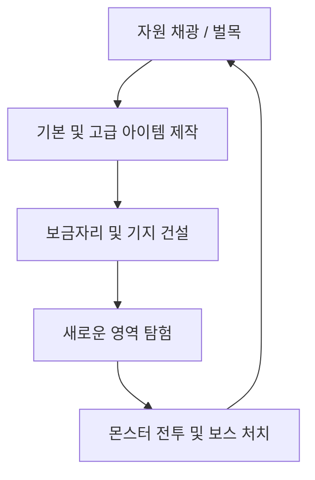

# 탑다운 크래프팅 게임 기획서 & 개발 가이드 (Game Design Document)

> [!IMPORTANT]
> **이 프로젝트에서 작업을 수행하는 AI 어시스턴트는 반드시 이 문서의 [1. AI 개발 가이드라인]을 가장 먼저 읽고 핵심 규칙을 준수해야 합니다.**

---

## 1. AI 개발 가이드라인 (AI Guidelines)

이 프로젝트에서 작업을 수행하는 AI 어시스턴트는 반드시 워크스페이스 루트의 **[AGENTS.md](./AGENTS.md)**에 명시된 규칙과 가이드라인을 가장 먼저 읽고 완벽하게 준수해야 합니다. 

핵심 내용은 다음과 같습니다:
- **작업 범위**: `RootDesk/MyDesk/` 폴더 하위 스크립트, 데이터셋, 모델 작성만 수행. `Environment/` 및 자동 생성 파일 수정 금지.
- **물리 컴포넌트**: 모든 동적 엔티티는 중력이 없는 `KinematicbodyComponent` 필수 사용.
- **하드코딩 금지 및 모듈화**: 유사 로직 필요 시 하드코딩하지 말고 데이터셋, 스트럭트, 컴포넌트 생성을 최우선 시도. 하드코딩이 불가피할 경우 진행 전 반드시 유저 승인 획득.
- **연동 검증**: `msw-maker-mcp`를 통한 `refresh` 및 런타임 로그 상호작용 검증 의무화.

---

## 2. 핵심 게임 루프 (Core Game Loop)

1. **채집 (Gathering)**: 맵 상의 다양한 타일(흙, 돌, 광석 등)과 오브젝트(나무)를 파괴하여 자원을 획득합니다.
2. **제작 (Crafting)**: 획득한 자원으로 도구(곡괭이, 도끼), 무기, 횃불, 건축용 타일 등을 제작합니다.
3. **건설 (Building)**: 타일을 설치해 벽을 세우고 방을 만들어 자신만의 기지를 구축합니다.
4. **전투 (Combat)**: 지하와 어둠 속에서 스폰되는 다양한 몬스터와 보스에 맞서 싸우고 새로운 고유 자원을 획득합니다.
5. **교역 (Trading)**: 희귀 드롭 아이템과 상위 장비를 다른 유저와 거래하며 경제 생태계에 참여합니다. (장기 목표)

### 2.1. 장르 포지셔닝 & 디자인 필러 (Genre Positioning & Design Pillars)

**레퍼런스 장르**: **스타듀밸리**(개인 농장·꾸미기)를 핵심 축으로, 마인크래프트·코어키퍼·테라리아의 채집/제작/건설 손맛과 **바람의 나라·메이플스토리**식 공용 사냥터(다른 유저와의 실제 조우)를 결합한 **탑다운 라이프·크래프트 게임**. 플레이어는 **나만의 영지를 가꾸고**(평화로운 농장/꾸미기), **공동 마을에서 교류·성장**하며(상점/퀘스트/연구), **사냥터로 원정**(전투/희귀 전리품)하는 세 갈래 루프를 오간다.

> ⚠️ **핵심 방향 전환 (2026-06)**: 시작 맵(개인 영지)은 더 이상 몬스터를 사냥하는 사냥터가 아니다. **스타듀밸리의 시작 농장**처럼 **개인이 꾸미고 가꾸는 평화로운 공간**이며, 전투/사냥은 별도의 **공용 사냥터 맵**으로 분리한다. 자세한 공간 구조는 §2.2 참조.

| 필러 | 의미 | 적용 원칙 |
|---|---|---|
| **나만의 보금자리** | 내 영지는 내가 가꾸는 평화로운 농장 — 꾸미고, 짓고, 쉰다 | 개인 영지 = green_island 농장 + 집/침대/창고 (§2.2, §3.5) |
| **영속적인 나만의 세계** | 내가 만든 것, 모은 것이 게임을 꺼도 그대로 남는다 | 모든 플레이어/월드 상태는 DataStorage에 영속화 (§3.6) |
| **살아있는 월드** | 캐낸 자원은 시간이 지나면 되살아나고, 세계는 멈추지 않는다 | 자원 차등 리스폰 + 점유 영역 보호 (§3.7) |
| **함께하는 모험** | 마을에서 만나고, 사냥터에서 함께 싸운다 | 공동 마을·사냥터 멀티플레이 (§2.2, §3.4) |
| **노력의 보상** | 더 깊이 원정하고 더 좋은 도구를 만들수록 더 희귀한 보상 | 테크 트리(§4) + 희귀도 등급(§3.8) + 사냥터 해금(§2.2) |
| **함께하는 경제** | 희귀한 전리품은 자랑하고, 남는 것은 거래한다 | 유저 간 거래/마켓 (§3.9) |
| **즉각적인 피드백** | 모든 행동에는 보고 듣는 반응이 따른다 | 타격감/실패 리액션/획득 연출 (§3.2, §3.5) |

---

### 2.2. 월드 구조: 3대 공간 (Three-Space World Structure)

월드는 성격이 뚜렷이 다른 **3종의 공간**으로 구성된다. 각 공간은 목적·인원·전투 여부가 다르며, 플레이어는 포탈을 통해 오간다.

| 공간 | 인원 | 전투 | 핵심 목적 | 맵 구현 |
|---|---|---|---|---|
| **① 개인 영지** (My Estate) | 1인 (+초대 손님) | ❌ (수동적 생물만) | 채집·제작·**건설/꾸미기**·휴식 | `Home_<UserId>` (map01 템플릿 동적 복제) |
| **② 공동 마을** (Town) | 서버 전체 | ❌ | 상점·거래·**퀘스트**·**연구소**·커뮤니티 | `map/town.map` (정적 상주 맵) |
| **③ 사냥터** (Hunting Grounds) | 서버 전체(공용 채널) | ✅ | **전투**·레벨링·희귀 전리품·**던전** | 별도 공용 맵 (해금형, 다수) |

#### ① 개인 영지 — "스타듀밸리의 시작 농장"
- **컨셉**: 사냥터가 아니라 **개인이 꾸미고 가꾸는 평화로운 공간**. 기본 지형은 우리가 처음 구상했던 **green_island 바이옴(흙 `BaseEarth` + 풀 `BaseGrass`)**으로 전면을 덮는다.
- **손디자인 단일 농장 템플릿 (⚖️ 2026-06-27 판결)**: 영지는 유저별 절차 생성이 아니라 **모두 동일한, 손으로 디자인한 green_island 농장 템플릿**에서 시작한다(스타듀밸리식 — 모든 플레이어가 같은 시작 농장). 템플릿을 유저별로 복제하고 유저별 변경분(설치 타일/가구/파괴 자원)만 델타로 영속화한다. 멀티바이옴 시드/노이즈 엔진은 **사냥터(§2.2 ③) 전용으로 보존**하며 영지에서는 구동하지 않는다. 절차 산포는 (해도) 옅은 자원 산포까지만.
- **계절 테마 (Seasonal Theme)**: 유저가 영지 컨셉을 **봄/여름/가을/겨울 4계절 테마**로 바꿀 수 있다. green_island 지형 구조(흙·풀 혼합 노이즈)는 유지하되 타일 스킨/색감만 계절별로 리스킨한다. **기본값은 봄(현재 green)**. (구현은 후속 단위 — 테마별 타일셋 교체 + 영지별 선택 영속화.)
- **개인 타일 편집 우선 (Player Build Priority)**: 플레이어가 건설/건축으로 타일 배치를 바꾸면(흙↔풀 변경 포함, 추가 예정) **그 배치를 절차 생성보다 우선**한다. 즉 절차 지형은 "초기 캔버스"일 뿐, 유저 설치 타일(`RectTileMap3`)/가구가 있으면 그쪽을 따른다.
- **크기 축소**: 영지를 확실히 더 작게 — **반경 30 (61×61 타일)**. (기존 반경 120에서 축소. `ResourceSpawner.MapRadius`.) 한 화면에 영지 대부분이 들어와 아늑하게 가꾸기 좋은 규모.
- **느린 자원 생성**: 시드 기반 자동 자원(나무/돌/풀)은 **더 천천히·희소하게** 생성한다(green_island `SpawnChance` 축소). 좁은 영지가 자원으로 뒤덮이지 않고, 꾸밀 여백을 남긴다.
- **수동적 생물만 (No Combat Mobs)**: 위협이 되는 전투 몬스터는 영지에 스폰하지 않는다. 장식·소량 자원용 **수동적 생물**(나비/소형 동물 등, 공격 없음)만 둔다. (전투형 `MonsterSpawner`는 이미 green_island를 스폰 제외하므로 green_island 전면화로 자동 분리됨.)
- **집·창고·특수 건물 (예정)**: 스타듀밸리처럼 **내 집 공간**, **창고**, **특수 건물**을 둔다. 집에는 **침대**가 있어 휴식한다.
  - **침대 수면 회복**: 침대에서 **10분**이면 체력·스태미나 **풀충전**. **침대에서 종료(로그아웃) 후 10분 이상 경과해 재로그인하면 풀충전 상태로 입장**한다(오프라인 경과 시간으로 환산).

#### ② 공동 마을 — 커뮤니티 센터
- **기능**: 기존처럼 **물건을 사고팔고**, **퀘스트를 받는** 곳이자 **커뮤니티 센터**. 서버 전체가 모이는 상주 공용 맵.
- **연구소 (Research Lab, 신규)**: 슬라임 등 몹에게서 얻은 아이템을 **연구**해 **획득 효율을 높이거나 가공 능력을 습득**하는 특수 공간.
  - 예: **멧돼지 다리**를 연구하면 그것을 **고기와 가죽으로 분해**하는 기술을 얻는다. 연구 완료는 **레시피/가공 기술 영구 해금**(영속화 대상, §3.6)으로 처리 — 데이터 주도(연구 항목·소요·산출을 데이터셋으로).
- **확장**: 마을 확장 및 추가 마을은 **패치로 단계 도입** 예정.

#### ③ 사냥터 — 공용 원정 공간
- **컨셉**: 바람의 나라/메이pl스토리 기본 컨셉처럼 **다른 장소로 이동해 다른 유저들과 실제로 마주치는** 공용 전투 공간.
- **공용 공간 전제**: 모든 사냥터는 **서버 전체가 공유하는 단일 인스턴스**(town과 동일 부류)다. 유저별 복제(영지 방식)가 아니라, 같은 맵에서 다른 유저와 실제로 조우한다.
- **단계적 사냥터 (Tiered / Chained — 디아블로2식)**: 사냥터는 **여러 구역(area)이 포탈로 연결된 단계 구조**다.
  - **체인 진행**: 초기 사냥터(Tier 1)에서 시작해, **구역 안의 연결 포탈을 타고 더 깊은 구역으로** 들어가며, 그 끝에 **보스**가 있다. (D2의 act → 연결된 area들 → act 보스 구조.) 즉 초기 사냥터여도 **연계 포탈을 통해 더 높은 보스까지** 도달할 수 있다.
  - **웨이포인트 해금 (영지 연결)**: 새 구역에 **최초로 도달해 그곳의 포탈을 열면**, 그 구역이 **영지 포탈 목록에 추가**되어 다음부터 영지에서 바로 진입할 수 있다(D2 웨이포인트). 해금 상태는 **영속화**하며 기본 **유저별**(D2 캐릭터식)로 둔다.
  - **두 진입 경로**: ① 영지 포탈 목록에서 **해금된 구역으로 직행**, ② 현재 구역의 **연결 포탈로 인접한 더 깊은 구역으로 도보 진행**.
- **난이도 곡선 (Gear-Tier Gating)**:
  - **초기 사냥터(Tier 1) 필드**: 웬만하면 **돌·나무 장비(T1/T2)로도 클리어 가능**한 낮은 난이도. 처음부터 쉽게 드나든다.
  - **Tier 1 보스**: **구리 빌드(Copper, T3)까지 완성해야 뚫을 수 있는** 난이도. → 따라서 **구리 광석/재료는 초기 사냥터 필드에서 드롭**되게 한다(영지에서 광석을 뺀 것을 사냥터가 보완). 루프: T1 필드에서 구리 채굴/드롭 → 구리 장비 제작 → T1 보스 격파 → 다음 티어 해금.
  - 이후 티어는 한 단계 위 재료(철 등)를 요구해, **장비 티어가 곧 진행 게이트**가 된다.
- **오픈 필드 지형 생성 (절차 + 로테이션, 구조와 분리)**: 각 오픈 필드 구역의 **지형/자원/몬스터 배치**는 절차 생성으로 변주를 준다 — 멀티바이옴 생성기(`ResourceSpawner`, `forceBiomeId=""`)에 **큐레이션된 시드 풀**을 넣고 **서버 시간 기준 약 3시간(`RotationPeriod`)마다** 활성 시드를 교체(`curatedSeeds[ floor(serverTime / RotationPeriod) % N ]`)해 "오늘의 사냥터"를 만든다. **단, 구역 연결·보스 위치·웨이포인트 같은 구조는 고정**(맵 픽스처)이며 **보스 아레나는 로테이션 대상이 아니다**. (로테이션 자체는 MVP 이후 — 우선순위는 구조/진행.)
- **손으로 박는 고정 픽스처**: 연결 포탈·복귀 포탈·NPC·보스 스폰 지점 등은 `.map`에 직접 배치한다(시드 로테이션과 무관하게 상주). 지형 생성기와 맵 픽스처는 레이어가 달라 충돌하지 않는다.
- **특수 던전 (디아블로2 카우방식)**: **특수 조건을 만족**하거나 **전용 포탈 아이템을 구매/획득**해 보유 중일 때만 목록에 노출/입장한다(D2 카우방/우버 포탈식). (범위 밖.)
- ⚠️ 광석(Copper/Iron)·Big Stone은 개인 영지에서 빠졌고, 위처럼 **사냥터 필드 드롭으로 공급**된다(특히 구리=Tier 1 사냥터). 금속 테크(§4 T3/T4)는 사냥터 출시 후 본격 가동.

#### 포탈 시스템 (Portal System) — 디아블로2 웨이포인트식
- **단일 통합 목록 포탈 (영지)**: **사냥터로 나가는 포탈은 영지에 둔다.** 기존 `Portal` 가구(이동 설치 가능)를 **목록형으로 확장** — F/상호작용 시 목적지 **목록 팝업**(D2 웨이포인트 메뉴식)을 띄우고, 행을 선택하면 해당 맵으로 워프한다. 목록은 `공동 마을` + 진입 가능한 `사냥터`들(+향후 보유한 특수던전 포탈)을 데이터 주도(`PortalDestinationDataSet`)로 구성한다.
- **가구로 위치 변경 유지**: 포탈은 기존처럼 인벤토리 배치 아이템이라 **설치/철거/재배치**가 가능하다(§3.2 건설 규칙 그대로).
- **마을 → 영지 복귀 단순화**: 마을의 복귀 포탈은 **상호작용 즉시 본인 영지(`Home_<UserId>`)로 직행**한다. 기존의 "유저 이름을 입력해 남의 영지 방문"(WarpPopup/`ServerRequestVisitHome`) 진입 동선은 **제거**한다. (남의 영지 방문은 추후 별도 포탈/방식으로 재설계 — 관련 서버 메서드는 비활성 보존.)
- **사냥터 → 복귀**: 사냥터의 고정 복귀 포탈은 공용 허브인 **공동 마을**로 돌려보낸다(영지↔마을↔사냥터 순환).
- **웨이포인트 해금이 목록을 키운다**: 영지 포탈 목록은 고정이 아니다. **새 사냥터 구역에 최초 도달해 그곳 포탈을 열면** 그 목적지가 목록에 추가된다(유저별 영속, §2.2 ③). 즉 진행할수록 영지에서 바로 갈 수 있는 곳이 늘어난다.
- **데이터 주도**: 목적지(맵/표시명/도착좌표/해금타입[waypoint·level·quest·item]/해금값/필요아이템)는 코드 분기 대신 `PortalDestinationDataSet`로 관리해, 사냥터·특수던전 추가가 **행 추가만으로** 반영되게 한다. MVP는 해금 무시(전부 노출)·이동만, 이후 해금 게이팅 적용.

---

## 3. 핵심 시스템 명세 (Core Systems Specification)

### 3.1. 플레이어 이동 및 조작
- **조작 방식**: 방향키 이동(4방향), Alt 비주얼 점프, Ctrl 공격/채광/설치.
  - **수평 facing & 방향 타게팅**: 시각 facing 스프라이트는 좌우로 유지되지만(메이플 스타일, `MovementComponent` 처리), 채광·설치 **대상 셀은 마지막 이동 입력 방향(상·하 포함, 4/8방향)**을 따른다(`PlayerController.LastDirectionX/Y`). 따라서 위/아래 인접 셀도 타격·설치할 수 있으며, 현재 겨냥 중인 셀은 **조준선(타겟 하이라이트)**으로 표시된다(§3.2).
- **물리 컴포넌트**: `KinematicbodyComponent` 사용 (중력 없음).
  - 속도 제어: 이동은 `MovementComponent`로 구동하며 [PlayerController.mlua](./RootDesk/MyDesk/Player/Scripts/PlayerController.mlua)가 `MovementComponent.InputSpeed`(기본 3.6)를 설정한다. (`PlayerController`의 `@Sync MovementSpeed` 등 스탯 값은 현재 HUD 표시용 placeholder이며 실제 이동에 직접 반영되지 않는다.)
  - **충돌 사전 검사**: 매 프레임 X/Y 이동을 각각 미리 검사(`IsObstacle` → `CollisionService:OverlapAll`)해 자원·가구 셀 침투를 막는다. `GrownGrass`·드롭 아이템은 통과 가능.
  - 채광/설치 입력에는 쿨다운(`MineCooldown` 기본 0.6초)이 적용된다.
- **카메라**: 플레이어를 추적하며 격자형 맵 탐색에 용이하도록 설정 (`ZoomRatio` 튜닝).
- **모바일/공용 컨트롤러**: 화면 하단 액션 버튼 패드(`MINE`/`JUMP`/`BAG`/`CRAFT`/`INFO`)가 모바일 컨트롤러 역할을 한다. 별도 `MobileController.mlua` 스크립트가 아니라 [UIHUDController.mlua](./RootDesk/MyDesk/UI/Scripts/UIHUDController.mlua)가 `/ui/HUDGroup/MobileUI` 버튼에 연결해 구현했으며, **PC에서도 동일하게 사용 가능**하도록 유지할 예정이다.
  - **가상 조이스틱(이동)**: MSW Maker 에디터의 **빌트인 UI 조이스틱 기능**으로 구현(커스텀 `JoystickComponent` 스크립트가 아님). **모바일 전용으로 켤 예정**이며, 현재는 테스트를 위해 활성화해 둔 상태다.

### 3.2. 격자형 자원 인터랙션 (엔티티 채광 전용)
- **맵 모드**: `TileMapMode = 1` (RectTileMap).
- **좌표 변환**: 플레이어 월드 좌표 -> 타일 셀 좌표 변환 (`ToCellPosition`)으로 바라보는 방향의 인접 셀을 계산.
- **자원 채집 (Mining) — 엔티티 전용**:
  - ⚠️ **타일 파괴(`RemoveTile`) 기반 채광은 폐기됨.** 지반/풀밭 타일맵은 순수 배경이며, 모든 채집 가능한 자원은 **독립 엔티티**(Stone, Big Stone, Tree, GrownGrass 등)로만 스폰됨.
  - 흐름: `PlayerController:RequestMine` → `ResourceSpawner.GridToEntity`에서 대상 셀의 자원 엔티티 조회 → `TileDurabilityManager:HitResource(map, pivotKey)`로 피격 전달.
  - 내구도: 자원별 피격 횟수를 `ResourceDataSet.csv`(`SourceId`/`MaxDurability`/`RequiredToolType`)로 관리. 현재 값 — **Stone 2 / Tree1 15 / Tree2 30 / Big Stone1 20 / Big Stone2 30 / GrownGrass 1**. (나무·큰 돌은 크기 변종이 2종씩 존재.) 10초간 미피격 시 내구도 자동 회복(`TileDurabilityManager.OnUpdate`).
  - 도구 효율: 요구 도구(`RequiredToolType`)와 장착 도구가 일치하면 타격당 데미지 = `1 + ToolPower`. 불일치(또는 도구 필요 자원을 맨손 타격)면 데미지 0 = "실패 타격". (예: Stone Pickaxe[power 2] = 3데미지/타.) GrownGrass는 요구 도구가 없어 맨손 채집 가능.
  - 파괴 시 드롭: `ItemDropLogic`(`ItemDropDataSet.csv` 기반 드롭 테이블)에서 소스 엔티티 이름(`SourceId`)으로 드롭 아이템/수량/확률을 조회하고, `item_dataset`에서 모델 정보를 찾아 아이템 엔티티를 스폰.
  - **점진 드롭 (Progressive Drop)**: 큰 자원은 완전 파괴 전에도 타격이 쌓이면 일부를 흘린다 — Tree는 5타마다 Wood 1개, Big Stone은 3타마다 Stone 1~2개를 드롭하고 남은 분량을 파괴 시 일괄 드롭. (타격마다 보상이 떨어져 손맛을 강화.)
  - **조준선 (Target Reticle) — ✅ 구현됨**: 채광 모드(도구/맨손/빈 슬롯)일 때, 마지막 이동 입력 방향(상·하 포함)으로 결정된 **대상 셀에 금색 반투명 하이라이트**를 표시한다. 설치 프리뷰와 **동일한 `PlacementPreview` 엔티티를 재사용**하며 상호 배타적(가구 선택 시 녹/적 설치 프리뷰, 그 외엔 금색 조준선). 어느 셀을 캘지 명확히 보여준다.
- **블록/가구 설치 (Building) — 구현됨**:
  - 퀵 슬롯에서 `Category=furniture` 아이템을 선택한 상태에서 **Ctrl(채광 키와 공유)**를 누르면 바라보는 인접 셀에 설치를 시도한다(우클릭 아님).
  - **설치 프리뷰**: 대상 셀에 반투명 미리보기를 띄워 설치 가능 시 녹색, 불가 시 적색으로 표시(`PlayerController:UpdatePlacementPreview`).
  - **2종 설치물**: `PlacedTileName`이 있는 아이템(예: Wood Floor)은 건설 레이어 `RectTileMap3`에 타일로 칠하고(`SetTile`), 그 외 가구(Furnace/Wooden Chest)는 `Furniture_<이름>` 모델 엔티티로 스폰.
  - **서버 검증**(`PlayerInventory:ServerRequestPlace`): 소유 여부, 플레이어와의 Chebyshev 거리 ≤ 4, 하단 지반 타일 존재, 대상 셀 미점유(`GridToEntity`), 플레이어 미겹침 확인 후 아이템 1개 차감.
  - **철거**: 설치물도 자원과 동일하게 Ctrl 채광으로 파괴(타일·가구 내구도 2)하며, 파괴 시 해당 아이템으로 회수된다. 화로/상자는 내부 보관물도 함께 드롭(`TileDurabilityManager`).
- **채집 실패 시각 리액션 (Harvest-Fail Reaction)**:
  - **목적**: 자원을 타격했지만 채집이 불가능한 경우(요구 도구 미장착, 도구 등급(Tech Lock) 미달 등), 플레이어가 "왜 안 캐지는지"를 즉시 인지할 수 있도록 명확한 시각 피드백 제공.
  - **판정 주체**: `TileDurabilityManager:HitResource`가 데미지 계산 시점에 채집 가능 여부를 판정. 데미지가 0이 되는 모든 케이스(등급 미달 등)는 "실패 타격"으로 분류.
  - **연출 (성공 타격과 명확히 구분)**:
    - **거부 흔들림(Refusal Shake)**: 기존 피격 흔들림(`ResourceReaction.mlua`의 Hit Shake)과 동일한 애니메이션 파이프라인을 재사용하되, **좌우로 짧게 "도리도리" 하는 별도 패턴**(진폭↓, 주기↑, 회전 없음)으로 차별화. 자원이 "거부"하는 느낌의 단일 애니메이션.
    - **색상 플래시 부재**: 성공 타격의 피격 플래시·파티클은 출력하지 않음 (내구도 변화 없음을 시각적으로 일치).
    - **(선택) 안내 말풍선**: 동일 자원에 실패 타격이 2회 이상 반복되면 1회에 한해 요구 도구 안내 말풍선 출력 (예: "곡괭이가 필요합니다"). 스팸 방지를 위해 자원당 쿨다운(예: 10초) 적용.
  - **데이터 주도 설계**: 실패 판정 기준은 기존 `ResourceDataSet`(RequiredToolType)과 `item_dataset`(ToolType/ToolPower)을 그대로 사용하며, 거부 흔들림의 진폭/주기/쿨다운 등 연출 파라미터는 `ResourceReaction` 컴포넌트 프로퍼티로 노출해 하드코딩 없이 튜닝 가능하게 한다.
  - **전달 경로**: 서버(`HitResource`) 판정 → 실패 시 클라이언트로 실패 이벤트 전파(Multicast 또는 대상 Client RPC) → 해당 자원 엔티티의 `ResourceReaction`이 거부 흔들림 재생.

### 3.3. 인벤토리 및 제작 (UI)
- **인벤토리**: 캐릭터가 획득한 자원, 무기, 소비품을 보관하는 격자형 슬롯 UI.
  - MSW의 `msw-ui-system` 기반 모듈형 UI 설계.
- **제작 (Crafting)**:
  - **C** 키(또는 모바일 CRAFT 버튼)로 제작창을 열고, 보유 자원으로 `RecipeDataSet.csv`(서버·클라 공용)의 레시피에 맞춰 제작한다. 레시피 선택 후 **Space** 키로 제작 발동. 재료·소유 검증은 서버(`PlayerInventory:ServerRequestCraft`)에서 수행.
  - 현재 제작은 **장소 제약 없이 어디서나 가능한 전역 제작**이며, 별도의 "제작대" 엔티티는 존재하지 않는다(근접 제작 분리는 §3.11 제안).
  - 예: Stone 2 → Hand Axe / Wood 1 + Stone 3 → Stone Pickaxe (§4 테크 트리 참조).
  - 도구·가구를 제작하면 비어 있는 첫 퀵 슬롯에 자동 등록되고, 도구라면 자동 장착된다.

### 3.3.1. 캐릭터 정보(User Info) 장착 표시
- **문제**: 현재 User Info(CharacterPopup)에서 어떤 도구/장비를 장착 중인지 확인할 수 없어 UX가 불편함.
- **장비 슬롯 패널 (EquipPanel)**:
  - **무기/도구 슬롯**: 현재 `@Sync EquippedTool` 값을 기반으로 장착 아이템의 **아이콘**(`item_dataset.IconRUID`)과 **이름**을 표시. 미장착 시 빈 슬롯 프레임 + "None" 표기.
  - **스탯 연동 표기**: 장착 도구의 `ToolType` / `ToolPower`를 함께 표시 (예: "Stone Pickaxe — 곡괭이 · 효율 +2"). 채집 효율 스탯(GatheringSpeed)과 시각적으로 연결.
  - **실시간 갱신**: 장착/해제(`ServerRequestEquip` 토글) 시 `EquippedTool` 동기화에 맞춰 팝업이 열려 있으면 즉시 갱신.
  - **확장 슬롯 (예약)**: 향후 방어구/장신구 테크 도입을 대비해 Armor 슬롯 자리를 유지 (현재 비활성 표시).
- **인벤토리와의 일관성**: 인벤토리의 `[E]` 마커, 툴팁 (Equipped) 표기와 동일한 데이터 소스(`EquippedTool`)를 사용해 표시 불일치가 발생하지 않도록 한다.

### 3.3.2. 퀵 슬롯 (Quick Slot)
- **목적**: 인벤토리를 열지 않고 도구/소비 아이템을 즉시 교체·사용할 수 있는 상시 노출 HUD 슬롯 바.
- **구성**:
  - **슬롯 수**: **10칸** (`PlayerInventory.QuickSlotsJson` 배열로 관리). 화면 하단에 가로 배치.
  - **슬롯 표시 요소**: 아이템 아이콘(`IconRUID`), 보유 수량, 선택 중 하이라이트 테두리. 수량이 0이면 아이콘을 흐리게 표시(슬롯 유지).
- **등록/해제**:
  - **등록**: 인벤토리 내에서 아이템을 **더블클릭**하면 빈 퀵슬롯에 자동으로 등록됩니다. (도구·가구 제작 시 빈 슬롯에 **자동 등록** 및 도구 장착 수행)
  - **해제**: 인벤토리가 열려 있는 상태에서 퀵슬롯에 등록된 아이템을 **더블클릭**하면 해당 퀵슬롯에서 즉시 해제(비워짐)됩니다.
  - **드래그 앤 드롭 (Drag & Drop)**: 퀵슬롯 간에 아이템을 드래그 앤 드롭하여 위치를 이동하거나 서로 스왑(Swap)할 수 있습니다.
    - **부드러운 마우스 밀착 드래그**: 터치/클릭 시작 지점과 아이콘의 로컬 좌표 오프셋을 `_UILogic:ScreenToLocalUIPosition`으로 보정하여, 드래그 시 고무줄 효과 없이 마우스 커서에 정확하고 깔끔하게 고정되어 따라오도록 구현했습니다.
  - **중복 등록 방지**: 동일한 종류의 아이템을 서로 다른 퀵슬롯에 중복 등록할 수 없습니다. 이미 등록된 아이템을 다른 퀵슬롯에 등록하거나 이동하면, 기존 등록 슬롯은 자동으로 초기화됩니다.
  - **클릭 동작 분리 (조작 간섭 방지)**: 인벤토리 아이템을 선택(inspect)한 상태에서 퀵슬롯을 클릭하더라도 슬롯 등록이 덮어씌워지지 않습니다. 싱글 클릭은 활성 슬롯 선택 및 장착/설치 전환 용도로만 안전하게 분리되었습니다.
  - 퀵 슬롯 항목은 아이템 **종류 참조**(이름 기반)로 저장 — 수량이 0이 되어도 슬롯은 유지되고 재획득 시 자동 복구.
- **사용 — "현재 손에 든 것" 선택자**:
  - **PC**: 숫자키 `1`~`9`,`0`(10번 슬롯)으로 슬롯 선택(`ServerSelectQuickSlot`). 모바일은 슬롯 터치.
  - 선택한 슬롯이 **도구**(`Category=tool`)면 자동 장착되고(`SyncEquippedToolToSelectedSlot`), **가구**(`Category=furniture`)면 설치 모드로 전환되어 Ctrl로 설치(§3.2)한다. 즉 퀵 슬롯이 채광 도구 장착과 설치물 선택을 통합 관리한다.
- **동기화/저장**:
  - 퀵 슬롯 구성·선택 인덱스는 `PlayerInventory`의 `@Sync` 프로퍼티(`QuickSlotsJson`, `SelectedQuickSlotIndex`)로 동기화한다. 차후 DataStorage 영속화와 연계(§3.6).
- **데이터 주도 설계**: 슬롯별 동작 분기(장착/설치)는 하드코딩하지 않고 `item_dataset.Category` 기반으로 분기 처리.

### 3.3.3. 아이템 버리기 및 드롭 시스템 (Discard & Drop System) — ✅ 구현 완료
- **UI 흐름**: 인벤토리에서 아이템 단일 클릭 → 툴팁 하단의 "버리기" 버튼 노출 → 클릭 시 수량 스테퍼 모달 활성화 → `-` / `+` 버튼 및 직접 입력을 통해 개수 조절 → "드롭" 또는 "삭제" 선택 (또는 "취소"). 가구(Portal, Furnace, Wooden Chest 등)도 동일하게 인벤토리 아이템이므로 버리기/드롭 가능.
- **서버 권위 검증 & 처리** (`PlayerInventory.mlua`의 `ServerRequestDiscard`):
  - 클라이언트 요청 시 `senderUserId` 검증 및 보유 수량 내로 버릴 개수 클램프 처리.
  - `mode == "drop"`일 경우 플레이어 위치 주변 바닥에 아이템 스폰.
  - `mode == "delete"`일 경우 아이템을 인벤토리에서 영구 삭제(차감).
- **드롭 재획득 방지 (자석 픽업 유예)** (`itemreact.mlua`의 `PickupGrace`):
  - 아이템 드롭 시점부터 2초간 자석 픽업(`Magnet`) 발동을 차단.
  - 플레이어가 2초 이내에 다른 곳으로 걸어나가면 바닥에 아이템이 보존되고, 제자리에 계속 서 있을 경우 유예 시간이 지난 후 자석 효과에 의해 다시 획득됨.
- **드롭 스폰 재사용** (`TileDurabilityManager.mlua`의 `SpawnResourceDrop`):
  - 기존의 채집으로 인한 드롭과 버리기 드롭을 단일 함수로 처리할 수 있도록 `pickupGrace` 파라미터 추가 (기존 채집 드롭은 유예 시간 0, 버리기는 2초).

### 3.4. 전투 및 몬스터 AI
> 🔁 **공간별 전투 정책 (2026-06 전환)**: **전투는 사냥터 전용**이다(§2.2 ③). **개인 영지**(§2.2 ①)에는 전투 몬스터를 스폰하지 않고 **수동적 생물만** 둔다. **공동 마을**(§2.2 ②)도 비전투 공간이다. 아래 전투/AI 사양은 **사냥터 맵**에 적용한다.

- **전투형 몬스터 스폰 (사냥터)**: `MonsterSpawner`가 사냥터 맵에서 주기적으로 변종 몬스터를 스폰한다. 바이옴/낮밤에 따라 HP·공격력 변종 차등(`MonsterSpawnDataSet`). **green_island 바이옴은 스폰 제외** — 따라서 영지를 green_island로 전면화하면 전투 몹이 자동 분리된다.
- **수동적 생물 (개인 영지, 예정)**: 영지에는 공격하지 않는 장식/소량 자원용 생물만 배치한다. 전투형 `Monster`/`MonsterAI`와 분리된 경량 스폰 경로를 사용(별도 데이터셋/스폰 가드). 위협·피격 없음.
- **몬스터 AI (사냥터)**: 중력 없는 `KinematicbodyComponent` 기반 상태 AI(`MonsterAI`) — 배회/추적/공격/복귀(§Phase 5 상세).
- **전투 (사냥터)**:
  - 플레이어가 무기를 휘둘러 피격 판정 범위 내의 몬스터에게 데미지 부여.
  - 체력(HP) 컴포넌트 및 피격 애니메이션(주황색 깜빡임 등) 적용.
- **현재 구현 상태**: 전투 파이프라인(`Monster`/`MonsterAI`/`MonsterMeleeAttack`/`MonsterSpawner`, 플레이어 `PlayerCombat`)은 이미 동작하나, **현재 단일 맵(개인 영지=동적 map01)에서 구동 중**이다. 전환 작업으로 이를 **사냥터 맵으로 이전**하고 영지에서는 비활성화한다.

---

### 3.5. 시드 기반 맵 생성 및 하이브리드 구조 (Seed-based Generation & Hybrid Structure)

> 공간 전체 구조(개인 영지/공동 마을/사냥터)는 **§2.2**를 단일 소스로 본다. 이 절은 맵 생성·하이브리드 구현 세부를 다룬다.

- **하이브리드 맵 구조 (동적 개인 영지 + 공용 마을 + 공용 사냥터)**:
  - **공동 마을 (TownMap - 멀티플레이어 공간)**: 서버당 고정 상주하는 공용 맵으로, 동시 접속한 모든 유저가 실시간 대화 및 상점/거래/퀘스트/연구를 진행합니다. 정적 맵(`map/town.map`)이라 절차 생성·자원 스폰·몬스터 스폰 대상이 아닙니다.
  - **사냥터 (Hunting Grounds - 공용 전투 공간, 예정)**: 멀티바이옴 절차 생성 + 전투 몬스터 스폰을 담당하는 공용 맵. 기존 개인 영지의 멀티바이옴/몬스터 로직을 이관해 구성합니다.
  - **내 집 / 개인 영지 (Home_UserID - 1인 전용 공간)**: 플레이어 진입 시 서버에서 map01 템플릿을 복제하여 동적으로 생성하며, 퇴장 시 메모리에서 삭제됩니다. **green_island 단일 바이옴 + 반경 30(61×61) + 느린 자원 생성 + 전투 몹 없음**으로 구성됩니다(§2.2 ①). ⚖️ **2026-06-27 판결**: 영지 지형은 절차 노이즈가 아니라 **map01 템플릿에 손디자인된 농장 레이아웃**을 사용하며(멀티바이옴 절차 오버레이는 영지에서 미구동, 사냥터 전용 보존), **플레이어 설치 타일/가구가 항상 우선**입니다.
  - **방문 및 초대**: 다른 유저(B)의 영지 방문 시, B의 맵이 이미 메모리에 있다면 그곳으로 텔레포트하고, B가 오프라인이라면 세이브 데이터에서 임시로 B의 영지를 빌드하여 A를 입장시킵니다.
  - **권한 관리**: 손님 유저가 집주인의 영지 내 자원이나 가구를 훼손할 수 없도록 소유자 ID 기반 권한 검증 시스템을 적용합니다.
  - **지형 (TileMap)**: static 타일맵으로 렌더링 성능을 최적화. ⚖️ **2026-07-07 타일 스킴**: Layer 1(`RectTileMap`)에 `Soil`을 전면으로 깔고, Layer 2(`RectTileMap2`)에 잔디 커버(`FullGrass` 중앙 + `Soil{LT..RD}` 프린지 + `Grass*Corner` 내부 모서리)를 덮는다. **잔디가 덮지 않은 셀 = 길**(아래 Soil이 드러남)이며, 길/광장 마스크는 사각형(rect) 조합으로만 디자인한다. (블록아웃 생성기: `scripts/build_maps.cjs`)
  - **상호작용 자원 (Entity)**: 나무(Wood), 석돌(Stone), 구리/철 광석(Copper/Iron Ore) 및 상자 등은 독립적인 엔티티(`Entity`)로 스폰.
  - **오브젝트 연출**: 자원 엔티티에 피격 흔들림(`ResourceReaction:PlayShake` — 회전+스케일), 채집 실패 거부 흔들림(`PlayRefusalShake` — 회전 전용), 플레이어가 가릴 때 반투명 알파 오클루전(`SetAlpha 0.4`), Y좌표 기반 정렬(`OrderInLayer`)을 구현해 타격감과 가독성을 제공한다. (별도 파티클 시스템은 아직 없음.)
- **시드 기반 절차적 월드 생성**:
  - `ResourceSpawner`의 결정론적 해시(`Hash2D`, sin 기반)와 그 위에 smoothstep 보간을 얹은 **값 노이즈(`Noise2D`)**로 시드가 같으면 지형·자원 배치를 100% 동일하게 복원한다. (정식 Perlin/Simplex가 아닌 경량 값 노이즈 구현.)
  - **시드 입력 및 리디자인**: 유저가 시드 문자열을 입력하면 이를 정수형 시드(`PrngSeed`)로 변환하고 맵의 배치 데이터를 초기화한 뒤 `SpawnInitialResources`를 재구동하여 맵을 재생성할 수 있도록 합니다. 시드 값만 DB에 저장해 둠으로써 세이브 파일 크기를 획기적으로 최적화합니다.

### 3.5.1. 접속/스폰 연출 최적화 및 워프 성능 개선 — ✅ 구현 완료
- **스폰 페이드 커버 (Spawn Fade Cover)** (`UIHUDController.mlua` + `build_ui.js`):
  - `HUDGroup` 내에 전체 화면을 덮는 검은색 스프라이트 `SpawnFade` (displayOrder: 9999, 입력 차단 활성화) 추가. 플레이어가 맵에 최초 진입하는 시점부터 100% 불투명 상태 유지.
  - 서버에서 플레이어 데이터 로드 및 홈 맵 로딩/복원이 정상 완료되면 클라이언트에 "홈 준비 완료" 신호를 송신하고, 클라이언트가 이를 수신하여 부드러운 페이드아웃 애니메이션 재생 후 `enable = false` 처리.
  - 신호 유실 등 예외 케이스 발생 시 검은 화면에 영구히 갇히는 현상을 방지하기 위해 8초 만료의 세이프티 폴백 타이머 탑재.
- **단일 워프 전환 (Single Warp Transition)** (`PersistenceManager.mlua`):
  - 기존의 로딩 과정에서 `(-3,0)` 고정 위치로 임시 워프한 뒤 0.5초 대기 후 실제 저장 위치로 재배치하는 이중 점프 메커니즘 제거.
  - `LoadPlayerData` 함수가 데이터 세팅 및 홈 맵 복원을 완전히 끝마친 후 저장된 최종 좌표로 단 한 번만 `MoveToMapPosition`을 호출하여 깔끔하고 즉각적인 스폰 보장.
- **자원 스폰 프레임 분할 (Chunked Resource Spawning)** (`ResourceSpawner.mlua`):
  - 맵 생성 시 약 1,000개 이상의 자원 엔티티를 한 프레임에 동기 스폰하던 병목 현상(약 1프레임 스톨 유발)을 개선.
  - 프레임당 최대 1500셀씩 스캔하는 청크(Chunk) 방식으로 분할 스케줄링하여 `SpawnInitialResourcesForMap` 호출이 지형 레이아웃 생성 직후 빠르게 반환되도록 구조 개선. map01 체류 시간 및 워프 지연 시간 단축.
  - 동시 진행되는 가구 데이터 복원과의 경합을 방지하기 위해 가구가 설치된 셀은 덮어쓰지 않도록 스폰 가드 조건 적용. 맵이 파괴되거나 전환될 때 안전하게 스케줄러를 중단하는 가드 포함.

---

### 3.6. 유저 데이터 영속화 (Persistence) — ✅ 구현 완료

> **원칙: 게임을 종료해도 유저의 모든 진행 상태는 유지된다.** 영속화되지 않는 신규 상태를 추가하는 것은 기획 위반으로 간주한다.

- **저장 매체**: MSW **DataStorage** (`_DataStorageService`). 서버 권위(Server-Authoritative)로만 읽기/쓰기 수행.
  - 플레이어 스탯, 인벤토리, 장착 도구, 퀵슬롯 목록은 `UserDataStorage`에서 `SaveData` 키를 통해 복구 및 관리됩니다.
  - 월드 설치 정보(타일 및 가구 정보) 및 파괴된 자원 이력은 `GlobalDataStorage`에 보존 및 복구됩니다.
- **영속화 대상**:
  - **플레이어 데이터** (UserId 키): 인벤토리 전체, 장착 도구(`EquippedTool`), 퀵 슬롯 구성, 레벨/XP/스태미나, 마지막 위치, (향후) 화폐 잔액·도감 진척.
  - **월드 데이터** (월드/셀 키): 유저가 설치한 건축물·가구(종류/셀 좌표/소유자), 상자(Wooden Chest) 보관 내용물, 자원 채집 상태(파괴 시각 타임스탬프 — §3.7 리스폰 계산의 근거).
- **저장 전략 — 캐시 → 더티 체크 → 디바운스 플러시**:
  - 런타임 상태는 메모리 캐시로 관리하고, 변경 시 더티 플래그만 기록. 루프/타이머 내 직접 Set/Get 호출 금지.
  - **플러시 시점**: ① 주기 저장(60초 간격), ② 플레이어 퇴장(`OnPlayerLeave`) 시 즉시 저장, ③ 중요 이벤트(제작 완료, 거래 성사, 건축 설치/철거) 직후 우선 저장.
- **스키마 버전 관리**: 저장 데이터에 `schemaVersion` 필드를 포함하고, 로드 시 버전별 마이그레이션 함수를 통과시켜 업데이트로 인한 세이브 호환성 파손을 방지.
- **장애 대응**: 로드 실패 시 신규 유저 초기값으로 시작하지 않고 재시도 → 실패 지속 시 안내 후 입장 차단 (데이터 유실로 인한 진행 손실이 가장 치명적인 UX이므로 보수적으로 처리).

### 3.7. 자원 리스폰 & 건축 점유 시스템 (Resource Respawn & Build Occupancy) — ✅ 구현 완료

- **리스폰 주기**: 채집으로 파괴된 자원 엔티티는 파괴 시점으로부터 설정된 대기 시간(GrownGrass: 5분, Stone: 30분, Tree: 1시간, Big Stone: 2시간 등) 경과 후 동일 셀에 리스폰됩니다.
  - **타임스탬프 기반 판정**: 파괴 시각(epoch) 기록 기반으로 판정하며, `(현재 시각 - 파괴 시각) >= RespawnDuration`인 셀을 일괄 리스폰 처리합니다.
  - **주기 스캔**: 10초 주기의 `TickResourceRespawn` 타이머로 만기 셀을 점진 리스폰 처리합니다.
  - **리스폰 연출**: 즉시 생성 대신 자연스럽게 0에서 1로 스케일 업되는 연출을 시각화합니다.
- **건축 점유 레지스트리 (Occupancy Registry)**:
  - **원칙: 유저가 건축한 구조물(벽/가구/상자/화로 등)이 점유한 셀에는 자원이 리스폰될 수 없다.**
  - 셀 키(`"x_y"`) → 점유 정보(`GridToEntity`)를 서버에서 관리하고, 건설 시 해당 범위에 이미 자원이나 플레이어가 겹치지 않는 경우에만 스폰할 수 있게 차단합니다.
  - 리스폰 판정 시 해당 셀이 점유 중(건축물이나 다른 플레이어)이면 철거될 때까지 스폰을 보류합니다.
- **데이터 주도 설계**: 리스폰 주기는 `ResourceDataSet`에 `RespawnDuration` 컬럼을 신설하여 자원 종류별로 데이터셋에서 조회하여 동작합니다.

### 3.8. 아이템 희귀도 & 전리품 시스템 (Rarity & Loot)

> 거래 경제(§3.9)가 성립하려면 "거래할 가치가 있는 물건"이 먼저 존재해야 한다. 희귀도는 그 토대다.

- **희귀도 등급**: `item_dataset`에 `Rarity` 컬럼 추가 — **Common / Uncommon / Rare / Epic / Legendary** 5등급.
  - UI 일관 표현: 등급별 색상(흰/녹/파랑/보라/주황)을 아이템 이름·슬롯 테두리·툴팁·드롭 연출에 공통 적용.
- **희귀 드롭 소스**:
  - **희귀 광맥**: 일반 자원 스폰 시 낮은 확률(예: 3%)로 희귀 변종(빛나는 광맥) 스폰 — 상위 재료 + 보너스 드롭.
  - **보스/정예 몬스터**: 고유 장비·도안(Recipe Scroll) 드롭 — 도안은 습득 시 제작 레시피 영구 해금(영속화 대상).
  - **보물 상자**: 월드 외곽 탐험 보상으로 절차 배치.
- **장비 고유성 (거래 대비)**: Rare 이상 장비는 발급 시 고유 ID(GUID)와 발급 이력(획득 경로/시각)을 부여 — 거래 추적 및 복제 검증의 기준.

### 3.9. 유저 간 거래 & 경제 (Player Trading & Economy)

> 최종 목표: **희귀 드롭 아이템과 장비를 유저끼리 사고팔 수 있는 경제**. 단계적으로 도입한다.

- **화폐 (Coin)**:
  - 단일 기축 화폐 "코인" 도입. 획득처: 몬스터 처치, 보물 상자, (향후) NPC 상점에 잡템 판매. 사용처: 유저 간 거래, NPC 상점, 수수료.
  - 잔액은 `@TargetUserSync`로 본인에게만 동기화하고 DataStorage에 영속화.
- **1단계 — NPC 상점 (경제 기반 다지기)**:
  - 기본 재료의 매입/매도 가격표를 데이터셋으로 정의 — 코인의 기준 가치 형성. MSWPackages의 상점 패키지 활용을 우선 검토.
- **2단계 — 직접 거래 (Direct Trade)**:
  - 근접한 두 유저 간 1:1 거래창. **2-Phase Confirm**(양측 제안 잠금 → 양측 최종 수락) 방식으로 한쪽 변경 시 상대 수락 자동 해제 — 거래 사기 방지의 업계 표준.
  - 서버 권위 검증: 제안 아이템의 실소유 여부, 수량, 거래 가능 플래그(`Tradable` 컬럼) 검사 후 원자적(atomic) 교환 — 부분 성공 상태가 남지 않도록 트랜잭션 처리.
- **3단계 — 마켓 보드 (비동기 거래)**:
  - 기지에 설치하는 "마켓 보드" 가구를 통해 판매 등록(아이템+가격) → 다른 유저가 오프라인 중에도 구매 가능.
  - 판매 대금은 우편함(Mailbox)으로 수령. 등록 수수료(예: 5%)로 인플레이션 억제. MSWPackages의 mail/shop 패키지 활용 검토.
- **경제 건전성 장치**:
  - **거래 로그**: 모든 거래를 서버 로그로 기록 (아이템 GUID 추적, 복제 버그 탐지 근거).
  - **거래 불가 품목**: 퀘스트/도안 등 진행 아이템은 `Tradable=false`로 차단.
  - **신규 유저 보호**: 계정 레벨 일정치(예: Lv 5) 미만 거래 제한으로 부계정 어뷰징 억제.

### 3.10. 바이옴 시스템 & 미니맵 (Biome System & Minimap)

> 🔁 **공간별 바이옴 정책 (2026-06 전환)**: 아래 멀티바이옴(5종) 시스템은 이제 **사냥터 맵 전용**이다. **개인 영지는 green_island 단일 바이옴으로 전면화**하고(흙+풀 혼합 + 4계절 리스킨, §2.2 ①), 멀티바이옴 매크로 그리드/변종 몬스터는 **사냥터로 이관**한다. `ResourceSpawner.GetBiomeAt`는 개인 영지(Home_*)에서는 green_island를 반환하도록 처리한다.

- **바이옴 개념**: 마인크래프트의 바이옴처럼 월드를 성격이 다른 지역으로 구분한다. (사냥터 한정. 개인 영지는 단일 green_island.)
- **매크로 그리드 저작 방식 (C안)**:
  - 맵 전체(151×151타일, 반경 75)를 **매크로 셀 15×15 (셀당 10×10타일)**로 나누고, `BiomeMapDataSet.csv` 한 장이 곧 월드 지도가 된다. CSV의 글자를 바꾸면 바이옴 배치가 바뀐다. 같은 바이옴을 여러 지역에 흩어 배치하는 자유 배치 가능.
  - **경계 디더링**: 매크로 셀 경계 ±2~3타일을 노이즈로 흔들어 직선 경계를 유기적인 곡선으로 만든다.
- **바이옴 5종 (초기)**: 녹색섬(green_island, 중앙) / 흙벌판(earth_field) / 바위지대(rocky) / 사막(desert) / 설원(snowfield).
  - **녹색섬**: 2차 노이즈로 풀밭(BaseGrass)과 흙(BaseEarth)이 유기적으로 섞인 지형. 비율/패치 크기는 데이터셋으로 튜닝.
  - 사막/설원/바위지대 전용 타일은 추후 타일셋 확보 시 `BiomeTerrainDataSet`의 TileName만 교체하면 적용된다 (현재는 BaseEarth placeholder).
- **데이터 주도 설계 (4개 데이터셋)**:
  - `BiomeMapDataSet` — **15×15 매크로 그리드 지도 (Row 0~14, C0~C14)**. 클라이언트 공개.
  - `BiomeDataSet` — 바이옴 메타 (DisplayName, MinimapColor, NoiseScale, NoiseSeedOffset). 클라이언트 공개.
  - `BiomeTerrainDataSet` — 바이옴별 지형 타일 구성 (노이즈 값 구간 → 타일). 서버 전용.
  - `BiomeResourceDataSet` — 바이옴별 자원 스폰 테이블 (ResourceName, SpawnChance, RequiredTile). 서버 전용. 신규 자원(예: Iron Node)은 행 추가만으로 배치 가능.
- **미니맵 (HUD 우측 상단) — 플레이어 중심 뷰포트**:
  - 기존 ResourcePanel을 대체. **플레이어를 중심으로 주변 60×60타일 영역**을 15×15 셀(셀당 4타일)로 표시 — 이동에 따라 스크롤된다. 플레이어 마커는 항상 중앙 고정.
  - `UIMinimapController`가 0.25초 주기로 **이미 동기화된 타일맵(`RectTileMap`/`RectTileMap2`)의 실제 타일을 읽어** 타일 이름 → 바이옴 색으로 칠한다(서버 통신 없음, 노이즈 재계산이 아님). 타일이 없는 맵 밖 영역은 어두운 색.
  - 확장 여지: 화로/상자 설치물, 보물 상자 아이콘 오버레이 (Phase 5/8 연계).

### 3.11. 게임 경험 보강 (Quality of Experience) — 제안

레퍼런스 장르의 핵심 재미를 끌어오기 위한 추가 제안 사항:

- **채광 방향 판정 & 조준선 (Targeting Reticle) — ✅ 구현됨 (유저 테스트 대기)**: 채광·설치 대상 셀을 **마지막 이동 입력 방향(상·하 포함, 4/8방향)**으로 결정하고(`PlayerController.LastDirectionX/Y`), 겨냥 중인 셀을 금색 반투명 조준선으로 표시한다. 설치 프리뷰와 동일한 `PlacementPreview` 엔티티를 재사용하며 상호 배타적이고, 시각 facing 스프라이트는 좌우로 유지한다. 동작 상세는 §3.1 / §3.2 참조.
- **낮/밤 주기 (Day/Night Cycle) — ✅ 구현됨**: 게임 내 1일 = 현실 10분(600초). 밤 오버레이 화면 톤 연출 및 야간 몬스터 스폰율/능력치 부스팅 연동 완료.
- **도감 (Collection Log)**: 획득한 아이템/처치한 몬스터를 기록하는 도감 UI. 수집 완성도에 따라 소소한 보상(코인/칭호) — 수집 욕구를 장기 리텐션으로 연결. (코어키퍼/스타듀밸리 스타일)
- **온보딩 퀘스트 라인**: "시작 Stone 줍기 → Hand Axe 제작 → 나무 채집 → Stone Pickaxe 제작 → Big Stone 채광 → 화로/상자 설치"로 이어지는 초반 가이드 퀘스트 — 현재 부트스트랩 흐름(§4)과 일치하며 핵심 루프를 자연스럽게 학습. MSWPackages 퀘스트 패키지 활용 검토.
- **획득/제작 연출 강화**: 아이템 획득 토스트(아이콘+수량), 제작 완료 시 결과물 팝 연출과 SFX, 희귀 드롭 시 등급색 빔 연출 — "한 번 더 캐고 싶은" 손맛의 마무리.
- **휴대용 제작 vs 제작대 분리**: 기본 레시피는 어디서나 제작 가능, 상위 레시피는 제작대/화로 근처에서만 제작 가능 — 기지로 돌아올 이유를 만들어 건설 시스템과 제작 시스템을 연결.
- **액티브 스킬 시스템 도입**: 단순 평타(`PlayerCombat`)에서 벗어나 클래스별/무기별 고유 액티브 스킬(대시, 범위 공격 등)을 장착하고 사용할 수 있는 조작감 및 전투 다양성 보강.

### 3.12. 플레이어 스킬 시스템 (Player Skill System) — ✅ 구현됨 (S1~S4 검증 완료 2026-07-05, 상세: [docs/design/skill-tree-plan.md](./docs/design/skill-tree-plan.md))

전투 및 모험의 손맛을 극대화하기 위해 MSW API 환경에 호환되는 플레이어 스킬 시스템을 기획한다.

#### 3.12.1. 기술적 구현 원칙 (MSW API 활용)
- **비주얼 효과 연출**: MSW 빌트인 `EffectService`를 사용해 스킬 시전 시 이펙트를 표현한다.
  - 버프 및 플레이어 추적형 이펙트: `_EffectService:PlayEffectAttached(...)`를 사용하여 캐릭터 몸에 이펙트를 고정한다.
  - 투사체 및 지면 고정형 이펙트: `_EffectService:PlayEffect(...)`를 사용하여 특정 좌표에 이펙트를 스폰한다.
- **정밀 타격 판정**: `SpriteRendererComponent`의 프레임 이벤트를 수신하는 `SpriteAnimPlayerChangeFrameEvent`를 활용한다. 애니메이션이 재생되다가 공격 판정이 발생하는 프레임(예: 7번째 프레임)에 도달했을 때 실질적인 데미지 박스 연산(`AttackFast`)을 수행하여 시각 효과와 피격 판정 타이밍을 일치시킨다.
- **데이터 주도 설계 (Data-Driven)**: 스킬의 쿨타임, 필요 스태미나/마나, 데미지 배율, 타격 범위, 이펙트 RUID 정보는 코드에 하드코딩하지 않고 `SkillDataSet.csv`를 통해 데이터베이스화하여 관리한다.

#### 3.12.2. 핵심 스킬 구성 계획 (T1~T4)
1. **대시/회피 스킬 (Dash / Roll) - 공용**:
   - **기능**: 입력 방향 또는 바라보는 방향으로 짧은 거리(예: 3타일)를 무적 판정과 함께 빠르게 이동한다.
   - **구현**: 중력이 없는 `KinematicbodyComponent` 제어 상태이므로, 대시 시 순간적으로 플레이어 속도(`MovementComponent.InputSpeed`)를 대폭 증가시키거나 좌표 변화를 주며, 캐릭터 잔상 이펙트(`PlayEffect`)를 재생한다.
2. **파워 스트라이크 (Power Strike) - 전사/근접**:
   - **기능**: 전방 부채꼴/직사각형 범위 내의 적들에게 강력한 물리 데미지를 입히고 넉백시킨다.
   - **구현**: `PlayerCombat`을 기반으로 하되, 범위 박스(`BoxShape` / `CircleShape`) 크기를 키우고 피격당한 몹의 넉백 세기 배율을 1.5배로 강화한다. 검기 이펙트 RUID를 부착한다.
3. **투사체 발사 스킬 (Magic Bolt / Arrow) - 마법사/궁수**:
   - **기능**: 바라보는 방향으로 원거리 마법 탄환이나 화살을 발사하여 첫 번째 충돌하는 적에게 데미지를 준다.
   - **구현**: 별도의 투사체 엔티티(`Projectile`)를 스폰하여 방향 벡터로 비행시키고, 몬스터의 `HitBox` 영역과 겹침(`Overlap`)이 감지되면 폭발 이펙트 재생 및 데미지를 적용한 후 소멸시킨다.

---

## 4. 자원 및 제작 테크 트리 (Progression Tiers)

> **부트스트랩(시작 자원)**: 작은 Stone은 곡괭이를, Tree는 도끼를 요구하므로(아래 표) 첫 도구를 만들 "씨앗 돌"이 필요하다:
> **Stone → Hand Axe(Stone 2) 제작 → 나무 채집 → Stone Pickaxe(Wood 1 + Stone 3) 제작 → 본격 채광/제련.**
> - **현재 구현 (월드 내장 방식으로 전환 완료)**: Stone 자원 노드 주변에 씨앗 돌(`AroundItem_Stone` / `Item_Stone`)을 **30% 확률로 함께 스폰**한다(`ResourceSpawner:TrySpawnResourceInChunk`). 부트스트랩이 월드에 녹아 있어 "정확히 5개"에 의존하는 경직성이 없다. (소프트락 자체는 허용 가능한 디자인으로 본다.)
> - 🗑️ **레거시 제거됨 (2026-06)**: 기존의 "첫 입장 시 Stone 5개 고정 지급"(`PlayerSpawnHandler:SpawnStonesForPlayer`)은 비활성화된 사장 코드여서 `PlayerSpawnHandler` Logic 전체를 제거했다. 부트스트랩은 위 월드 내장 확률 스폰으로 일원화.

현재 구현된 테크(✅)와 계획된 테크(⏳)를 함께 표기한다.

| 티어 | 자원 (엔티티) | 필요 도구 | 주요 제작/가공 아이템 | 상태 |
|:--:|---|---|---|:--:|
| **T1** | **Wood** (Tree1/Tree2) | 도끼(axe) | Hand Axe(Stone 2), Stone Axe(Stone 3+Wood 1), Wooden Chest(Wood 8), Wood Floor(Wood 2), Furnace(Stone 8+Wood 4) | ✅ |
| **T2** | **Stone** (Stone/Big Stone1/Big Stone2) | 곡괭이(pickaxe) | Stone Pickaxe(Wood 1+Stone 3), Furnace 재료 | ✅ |
| **—** | **Grass** (GrownGrass) | 맨손 | (재료) | ✅ |
| **T3** | **Copper Ore** | 곡괭이 | 화로 제련 → Copper Bar (2 Copper Ore→1, 5초) → 구리 곡괭이/도끼 | 제련 ✅ / 구리 장비 ⏳ |
| **T4** | **Iron Ore** | 구리 곡괭이(Tech Lock 예정) | 화로 제련 → Iron Bar (2 Iron Ore→1, 8초) → 철 곡괭이/도끼·철제 장비 | Iron 노드·장비 ⏳ |

- **도구 효율 값**(`item_dataset`): Hand Axe(axe, ToolPower 0) / Stone Pickaxe(pickaxe, ToolPower 2) / Stone Axe(axe, ToolPower 2). 데미지 = `1 + ToolPower`.
- **연료**(`FurnaceFuelDataSet`): 현재 Wood(10초/개).
- ⚠️ 기존 표의 **흙(Dirt) 채광·흙벽/돌담/횃불/제작대**는 미구현이며, 지반·풀밭 타일은 채집 불가 배경이다(§3.2).
- ⚠️ **광석 공급원 전환 (2026-06)**: 개인 영지를 green_island로 전면화하면 **Copper/Iron Ore·Big Stone은 영지에서 더 이상 스폰되지 않는다**(이들은 earth_field/rocky/desert/snowfield 전용 자원이었고, 해당 바이옴은 사냥터로 이관됨). 따라서 **T3/T4 금속 테크는 사냥터(또는 마을 상점/연구소) 출시 이후 본격 가동**되는 것을 정식 진행 곡선으로 본다. 그전까지 영지 테크는 T1(Wood)·T2(Stone) 중심이다. (영지에서도 소량 금속을 원하면 green_island `BiomeResourceDataSet`에 낮은 확률로 광맥을 추가하는 것은 가능하나, 기본 방향은 사냥터 보상으로 둔다.)

---

## 5. 작업 관리 및 진행 현황 (Task Tracker)

> [!NOTE]
> **플레이 테스트는 제작자(사용자)가 직접 수행한다.** AI 어시스턴트는 구현 + `refresh` 동기화 + 빌드 로그 확인까지만 수행하고, `play`를 통한 런타임 테스트는 실행하지 않는다.

### Phase 1: 개발 환경 및 설계 구성 (완료)
- [x] MCP 서버 연동 및 윈도우 환경 실행 에러 해결 (`/d` 플래그 적용)
- [x] 기획서(`game_design.md`) 구성 및 핵심 사양 정의
- [x] 프로젝트 파일 통합 및 AI 개발 가이드 작성
- [x] 월드 설정 확인 (`map01.map`의 RectTile 모드 동작 검증)

### Phase 2: 탑다운 이동 및 조작 고도화 (완료)
- [x] 플레이어 캐릭터 모델(`KinematicbodyComponent`) 정의 및 교체
- [x] 방향키를 이용한 4방향 정밀 이동 스크립트 작성 (클라이언트-서버 동기화)
- [x] Alt 키 입력 시 비주얼 점프 액션 구현
- [x] Ctrl 키 입력 시 Melee 공격/휘두르기 애니메이션 처리
- [x] 카메라 추적 로직 및 격자 경계선 처리
- [x] 모바일/공용 액션 버튼 패드(MINE/JUMP/BAG/CRAFT/INFO) 구현 ([UIHUDController.mlua](./RootDesk/MyDesk/UI/Scripts/UIHUDController.mlua)의 `/ui/HUDGroup/MobileUI` 연결, PC 공용). 가상 조이스틱은 에디터 빌트인 UI 조이스틱으로 구현(모바일 전용 예정, 현재 테스트용 활성)

### Phase 3: 다이내믹 맵 레이아웃 & 자원 스폰 시스템 고도화 (완료)
- [x] 자원별 내구도 추적 기능 구축 (`ResourceDataSet` — Stone 2 / Tree 15·30 / Big Stone 20·30 / Grass 1)
- [x] 자원 파괴 시 `item_dataset` 모델을 활용한 자원 드롭 아이템 동적 스폰
- [x] 드롭 아이템의 비주얼 점프/플로팅 애니메이션 및 플레이어 유도(자석) 효과
- [x] 플레이어 인벤토리 컴포넌트 추가 및 획득 자원 로깅
- [x] 타일셋 `tile1.tileset`에서 `Baram_47`을 `BassGrassLD2`로 리네임하여 풀밭 타일셋 세트 완성
- [x] `map01.map`에 채집 불가능한 `BaseEarth` 및 `BaseGrass` 타일들로 구성된 중앙 풀밭 섬 기둥 기초 땅 레이아웃 배치
- [x] `ResourceSpawner.mlua`에서 시작 시 기존 베이스 땅 타일 정보를 스캔/저장하고 그 위에 자원만 오버레이 스폰하도록 개선
- [x] `TileDurabilityManager.mlua`에서 자원 채광 시 원래 자리에 있던 베이스 땅 타일을 동적으로 복구하도록 고도화
- [x] 카메라 줌 아웃 비율 커스터마이징 (`ZoomRatio = 60.0` 기본값 적용)

### Phase 4: 시드 기반 맵 생성 및 하이브리드 구조 전환 (완료)
- [x] PRNG(의사난수 생성기) 스크립트 모듈 구현 (`ResourceSpawner:Hash2D` 기반 결정론적 난수 생성)
- [x] 값 노이즈(value noise) 기반 대형 2D 지형 맵 생성 연동 (`ResourceSpawner:Noise2D` — sin 해시 + smoothstep 보간을 통한 오토타일링 및 월드 지형 배치)
- [x] 자원 타일 스폰 로직을 엔티티 스폰 및 배치 체계로 전환 (Stone, Big Stone, Tree, GrownGrass 등의 엔티티 모델 동적 스폰 체계 구축)
- [x] 개별 자원 엔티티에 피격 시 회전/Scale 미세 진동 흔들림 효과 컴포넌트 장착 ([ResourceReaction.mlua](./RootDesk/MyDesk/ResourceReaction.mlua) - Hit Shake 효과 및 플레이어 위치 가림 시 반투명화 알파 오클루전 처리 구현)
- [x] 플레이어 위치 주변 자원 오브젝트 청크 기반 동적 로딩 최적화 기법 도입 (`ResourceSpawner:CheckProximityLoading`을 통한 플레이어 반경 15.0 범위 내 동적 활성화/비활성화 제어)

### Phase 4.5: 아이템 드롭 체계 정리 — 엔티티 채광 전용 전환 (완료)
- [x] `ItemDropLogic` + `ItemDropDataSet.csv` 기반 소스별 드롭 테이블 도입 (SourceId / ItemId / MinCount / MaxCount / Probability)
- [x] `TileDurabilityManager`에서 타일 파괴(`RemoveTile`) 기반 채광 로직 전면 삭제 — 자원 획득은 스폰된 엔티티 피격으로만 가능
- [x] `UserDataRow:GetCell` 오호출 버그 수정 (`UserDataRow`의 올바른 API는 `GetItem(columnName)`) — `[LEA-2011] AttemptToCall: 'GetCell'은 nil` 오류 해결
- [x] `ItemDropDataSet.csv`의 아이템 ID를 `item_dataset.csv`의 실제 id와 일치하도록 정규화 (`big_stone`→`stone`, `copper_ore`→`copper ore`)
- [x] `PlayerController:RequestMine` 정리 — 타일 분기 제거, 자원 엔티티 pivot key 기반 `HitResource` 호출로 단순화

### Phase 4.6: 인벤토리/크래프팅/장착/도구 효율 시스템 (완료)
- [x] `RecipeDataSet`(serveronly=false) 신설 — 레시피를 단일 소스로 통합, 클라이언트 UI(`UICraftingController`)와 서버 검증(`PlayerInventory:ServerRequestCraft`)이 동일 데이터셋 사용 (하드코딩 중복 제거)
- [x] `item_dataset`에 `Category` / `ToolType` / `ToolPower` 컬럼 추가 — 도구(wooden_axe, stone_pickaxe, stone_axe) 메타데이터 정의
- [x] `PlayerInventory` 확장 — `RemoveItem`(재료 차감), `@Sync EquippedTool`, `ServerRequestEquip`(소유/카테고리 서버 검증, 토글), `GetEquippedToolInfo`
- [x] 인벤토리 UI 장착 연동 — 장비 슬롯 클릭 시 장착 토글, `[E]` 마커 + 툴팁 (Equipped)/(Click to equip) 표시
- [x] `ResourceDataSet` 신설(SourceId / MaxDurability / RequiredToolType) — 자원별 내구도·효율 도구를 데이터로 관리 (돌/큰돌=pickaxe, 나무=axe, 풀=무관)
- [x] 도구 효율 채집 — `TileDurabilityManager:HitResource`가 공격자의 장착 도구를 조회, 요구 도구 일치 시 타격당 데미지 `1 + ToolPower` (예: Stone Pickaxe[power 2] = 3데미지/타). 요구 도구 불일치·맨손은 데미지 0(실패 타격)
- [x] `ItemDropLogic` 드롭 테이블 세션 간 누적 버그 수정 (`InitDropTables`에서 초기화)

### Phase 4.7: 채집/장착 UX 보강 — 실패 리액션, 장착 표시, 퀵 슬롯 (완료)
- [x] **채집 실패 시각 리액션** (기획: §3.2 "채집 실패 시각 리액션"):
  - `TileDurabilityManager:HitResource`에 채집 가능/불가 판정 분기 추가 — 데미지 0 케이스를 실패 타격으로 분류하고 클라이언트로 실패 이벤트 전파.
  - `ResourceReaction.mlua`에 거부 흔들림(Refusal Shake) 패턴 추가 — 기존 Hit Shake와 별도의 좌우 단진동 애니메이션, 진폭/주기 프로퍼티화.
  - 실패 타격 반복 시 요구 도구 안내 말풍선 1회 출력 (자원당 쿨다운 적용).
- [x] **User Info 장착 표시** (기획: §3.3.1):
  - CharacterPopup EquipPanel의 무기/도구 슬롯에 `EquippedTool` 기반 아이콘(`IconRUID`)·이름·ToolType/ToolPower 표기.
  - 미장착 시 빈 슬롯 + "None" 표기, 장착 토글 시 실시간 갱신.
- [x] **퀵 슬롯 시스템** (기획: §3.3.2):
  - HUD 하단 **10칸** 퀵 슬롯 바 UI 추가 (아이콘/수량/선택 하이라이트).
  - `PlayerInventory`에 퀵 슬롯 배열(`@Sync QuickSlotsJson`, `SelectedQuickSlotIndex`) 및 등록/선택 RPC 추가.
  - PC 숫자키 `1`~`9`,`0` 및 모바일 터치로 슬롯 선택 — `Category` 기반 장착(도구)/설치(가구) 분기.
  - 인벤토리에서 아이템 선택(inspect) 후 퀵 슬롯 클릭으로 등록. 도구·가구 제작 시 빈 슬롯 자동 등록·자동 장착.

### Phase 4.8: 바이옴 시스템 & 미니맵 (완료)
- [x] 바이옴 데이터셋 4종 신설 — `BiomeMapDataSet`(15×15 매크로 그리드 지도), `BiomeDataSet`(메타/미니맵 색), `BiomeTerrainDataSet`(지형 타일 구성), `BiomeResourceDataSet`(자원 스폰 테이블) (기획: §3.10)
- [x] `ResourceSpawner` 바이옴 기반 전면 개편 — 매크로 그리드 조회 + 경계 노이즈 디더링, 바이옴별 2차 노이즈 지형 결정(녹색섬 = 풀밭/흙 혼합), 데이터셋 기반 자원 스폰 (하드코딩 패스 3종 제거)
- [x] HUD 우측 상단 ResourcePanel 제거, 미니맵 신설 — 바이옴 색 셀 그리드 + 플레이어 마커 (`UIMinimapController.mlua`, 이후 아래에서 플레이어 중심 뷰포트로 전환)
- [x] 풀밭 오토타일 정규화 패스 — 13종 타일로 표현 불가능한 모양(고아 셀/폭 1 목·돌출/대각 단절)을 타일 칠하기 전에 제거·보정하여 경계 끊김 해소
- [x] 맵 확장 — 반경 35→75 (151×151타일), 매크로 그리드 15×15로 확장 및 바이옴 자유 배치 (녹색섬 2곳, 사막/설원/바위 다중 지역)
- [x] 미니맵 플레이어 중심 뷰포트 전환 — 주변 60×60타일 창을 15×15 셀로 스크롤 표시, 클라이언트 노이즈 재계산 기반
- [x] 인벤토리 툴팁 시인성 수정 — 크림 배경 위 크림 글씨(Desc/Count/CapacityText)를 진갈색으로 교체, 설명 폰트 16→18
- [x] 유저 플레이 테스트 (바이옴 경계/대형 맵 성능/미니맵 스크롤/툴팁 가독성 확인)
- [x] 사막/설원/바위지대 전용 지형 타일 확보 및 `BiomeTerrainDataSet` 교체

### Phase 5: 제련 시스템, 테크 확장, 몬스터 AI 및 기지 빌딩 (진행 중)
- [x] **인벤토리 아이템 버리기 및 드롭 시스템 구현 (완료)**:
  - 툴팁 하단 "버리기" 버튼 및 수량 스테퍼 모달 추가 (build_ui.js 패치 및 UIInventoryController.mlua 연동).
  - 서버 권위 검증 로직 `ServerRequestDiscard(itemName, count, mode)` 추가 (PlayerInventory.mlua).
  - 드롭 2초간 자석 픽업 차단(PickupGrace) 메커니즘 적용 (itemreact.mlua) 및 TileDurabilityManager.mlua 연동.
- [x] **금속 제련소(Furnace/화로) 및 가공 시스템 구현 (완료 — 유저 테스트 대기)**:
  - 돌(8개) + 나무(4개)로 제작 가능한 가구형 화로 엔티티 모델 (`npc/1013432.img` 리소스 활용) 설계.
  - 플레이어가 설치된 화로와 상호작용(F) 시 열리는 전용 제련 UI (`FurnacePopup`) + 인벤토리 동시 표시. 진행도 Progress Bar 슬라이더 배치.
  - 입력/연료/산출 슬롯 운용: 인벤토리 아이템 **더블클릭(즉시 투입)** 또는 **싱글클릭 선택 후 슬롯 클릭** 방식으로 투입, 성공/실패 색상 플래시 피드백.
  - 서버 타이머 기반 제련 연산: `FuelTimeRemaining`, `ProgressTime`, `IsSmelting`을 서버 `@Sync` 프로퍼티로 관리하여 UI가 닫혀도 백그라운드 제련 지속.
  - **데이터 주도 설계**: 연료/제련 레시피를 하드코딩하지 않고 데이터셋으로 관리.
    - `FurnaceFuelDataSet` (`FuelItem`, `BurnTime`) — 예: Wood / 10초.
    - `SmeltingRecipeDataSet` (`InputItem`, `InputCount`, `OutputItem`, `SmeltDuration`) — 예: 2 Copper Ore→Copper Bar(5초), 2 Iron Ore→Iron Bar(8초).
    - 신규 연료·광석 추가 시 CSV 행만 추가하면 자동 반영 (서버 `Furnace.mlua` + 클라 `UIFurnaceController`/`UIInventoryController` 모두 데이터셋 조회).
- [x] **화로의 배치 가능 아이템화 & 철거/재설치 (Placeable Furniture) — 구현됨**:
  - 화로·상자·바닥은 제작 시 **배치 아이템**으로 인벤토리에 지급된다(엔티티 직접 스폰 아님).
  - **설치**: 퀵 슬롯에서 가구 선택 후 Ctrl로 인접 셀에 스폰 + 거리(≤4)·지반·점유·플레이어 겹침 검증(`ServerRequestPlace`) + 녹/적 프리뷰.
  - **철거**: Ctrl 채광으로 설치물 타격 시 파괴(내구도 2) → 해당 아이템 회수 + 점유 해제. 화로/상자는 내부 보관물도 함께 드롭(`TileDurabilityManager`).
  - **재설치**: 회수 아이템을 다른 빈 셀에 다시 설치 → 이동 배치 루프 성립.
  - ⏳ 잔여: 점유 레지스트리의 DataStorage 영속화(§3.6/§3.7)와 소유자 기록(현재 인메모리 `GridToEntity`).
- [x] **광석 추가 및 테크 등급 도구 밸런싱 (완료)**:
  - [x] `iron_ore`(철 광석), `copper_bar`(구리 주괴), `iron_bar`(철 주괴) 아이템 추가 및 RUID 매핑.
  - [x] 신규 채집용 철광석 노드 (`Iron Node`) 추가: 바위(Rocky), 사막(Desert), 설원(Snowfield) 바이옴에 절차적으로 스폰되도록 연동.
  - [x] 신규 장비 4종 추가: 구리 곡괭이/도끼 (Tier 3), 철 곡괭이/도끼 (Tier 4) 및 성능/도구 효율 반영.
  - [x] 등급 잠금(Tech Lock) 적용: `Iron Node` 채광 시 구리 곡괭이(Tier 3, ToolPower 3) 이상의 도구 장착 필수 조건 부여 (낮은 등급의 도구 사용 시 내구도 데미지 0 처리 및 "You need a stronger Pickaxe to gather this!" 말풍선 출력).
  - [x] **바이옴별 드롭 차등화**: 자원이 파괴되는 위치의 바이옴 ID를 동적으로 판별하고, 해당 바이옴에 특화된 드롭 아이템 및 확률로 드롭 롤링이 진행되도록 구현 (예: Rocky 바이옴의 Big Stone 채집 시 Stone 대신 더 높은 확률의 Copper/Iron Ore 드롭).
- [ ] **탑다운 격자형 몬스터 AI 및 전투 통합** (🔶 진행 중):
  - ✅ M1 완료: 제네릭 몬스터 행동 스크립트 3종(`Monster`/`MonsterAI`/`MonsterMeleeAttack`, `RootDesk/MyDesk/Monster/Scripts/`), `Slime.model`(Pattern A·RectTile·Kinematicbody, modelId `slime`, 녹색 슬라임 `mob/0210100.img`), map01 테스트 배치(SlimeTest01). 빌드 클린.
  - ✅ M2a 완료: 플레이어 Ctrl 공격→몬스터 데미지. `PlayerCombat`(AttackComponent, BaseDamage 8) DefaultPlayer에 부착, `PlayerController:RequestMine`이 조준 셀의 몬스터 감지 시 채광 대신 공격(`FindMonsterAt`). Slime에 `DamageSkinComponent` 추가(피격 숫자). 빌드 클린.
  - ✅ M2b 완료:
    - ✅ 몬스터→플레이어 데미지: 슬라임 AI가 인접 시 접촉 공격, 베이스 `player` 모델 내장 HitComponent가 HP 자동 차감.
    - ✅ 넉백 양방향 및 보간: 피격 시 EaseOutCubic 곡선을 이용해 롤백 없이 부드럽게 감속하는 클라이언트 넉백 연출 적용.
    - ✅ 연속 피격/넉백 정상화: IFrameTimer의 갱신을 서버 타이머 루틴으로 이관하여 2차 피격 넉백 씹힘을 완전히 제거함.
    - ✅ 완료: 사망(HP0)→3s 후 (0,0) 리스폰 + 자원 50% 손실, 플레이어 피격 적색 플래시(아바타), 도구 등급별 공격력 스케일링(ToolPower * 4).
  - ✅ AI 추격 튜닝 완료: 몬스터가 플레이어에게 끝까지 달려들지 않고 바로 앞칸에서 공격을 멈추던 현상을 `DSq <= 0.81`(밀착) 및 공격 쿨타임 중에도 근접 타겟팅을 유지하도록 튜닝하여 해결.
  - [x] M3 완료: `MonsterSpawner`(@Logic, 맵당 인구캡, 바이옴별 변종 HpMul/AtkMul, 녹색섬 중앙 제외, 10분 주기 낮/밤 부스트 적용 완료) + `MonsterSpawnDataSet`.
  - 중력이 없는 `KinematicbodyComponent`를 사용하는 몬스터 모델(예: Slime 또는 Zombie) 제작.
  - 상태 기반 AI 컴포넌트 (`MonsterAI.mlua`) 설계:
    - **배회(Wander)**: 스폰 위치 반경 5칸 이내의 랜덤 셀을 목표로 저속 이동 후 대기.
    - **추적(Chase)**: 6칸 이내에 플레이어 감지 시 타겟팅 후 최단 경로 추적. 사막/설원/바위 지역 등 외곽 바이옴으로 갈수록 체력/공격력이 높은 변종 몬스터 배치.
    - **공격(Attack)**: 인접(1칸 이하) 시 플레이어 체력 차감.
    - **복귀(Return)**: 플레이어가 10칸 이상 멀어지면 스폰 포인트로 복귀.
  - ✅ 귀환(Return) 중 플레이어 무시 현상 해결: RETURN 상태가 무조건 복귀만 하던 락을 제거하고 **중단 가능**하게 변경. ①리쉬 반경 안에서 플레이어가 감지 범위에 들어오면 즉시 CHASE 재전환, ②피격 시 `AggroGraceTimer`(모델 프로퍼티 `AggroGraceDuration` 기본 4초)를 갱신해 넉백 종료 후 귀환을 버리고 돌아서서 추격/반격(유예 동안 리쉬 보류). 데이터 주도(`MonsterAI.ApplyKnockback`/`OnUpdate`).
  - ✅ 몬스터 반투명/깜빡임 현상 해결: Slime 모델이 Pattern A `MonsterAI`(수동 SpriteRUID 스왑)와 레거시 `StateAnimationComponent`(ActionSheet) 애니메이션 파이프라인을 **동시 보유**해, HitComponent+StateComponent로 자동 등록된 `HIT` 상태 전이 시 ActionSheet에 없는 `hit` 키를 재생하려다 스프라이트를 비우던 충돌이 원인. 중복 `StateAnimationComponent`(+고아 `ActionSheet` 값) 제거로 `MonsterAI`를 스프라이트 단독 제어자로 일원화.
  - 플레이어 체력 컴포넌트 (`PlayerHealth.mlua`) 도입 및 UI 연동:
    - 피격 시 적색 깜빡임 화면 연출, 넉백(바라보는 반대 방향 격자로 밀림), 피격 무적 시간(i-frame) 1초 동안 반투명 깜빡임 연출 적용.
    - 사망 시 3초 후 중앙(0,0)에 전체 체력으로 리스폰 및 원자재 인벤토리 자원 50% 유실 처리.
- **그리드 기반 기지 건설 및 보관 시스템 (일부 구현)**:
  - [x] 건설 배치: 퀵 슬롯 가구/타일 선택 후 Ctrl로 인접 셀 설치, 거리(≤4)·지반·점유 검사 + 격자 중심 `(cx+0.5, cy+0.5, 0)` 스폰/타일 칠.
  - [x] 청사진 프리뷰: 바라보는 셀에 반투명 미리보기(가능=녹색/불가=적색).
  - [x] Wooden Chest **설치/철거** 가능.
  - [x] 설치된 상자를 열어 보관하는 8슬롯 저장 UI (`UIChestController`, F키 상호작용).
  - [x] 상자 보관 데이터(`ChestStorageMap[UUID]`) 및 저장 UI, Phase 6 영속화 연동 완료. 철거 시 내부 아이템 필드 드롭 연동 완료 (`TileDurabilityManager`).
  - [x] 건설/철거 시 영속 점유 레지스트리 연동 (`ResourceSpawner`의 `GridToEntity` 점유를 통한 자동 리스폰 차단 완료).

### Phase 6: 유저 데이터 영속화 (완료) — §3.6
- [x] DataStorage 저장 계층 구축 — 캐시 → 더티 체크 → 디바운스 플러시 패턴의 공용 저장 모듈(`PersistenceManager` Logic) 설계.
- [x] 플레이어 데이터 영속화: 인벤토리/장착 도구/퀵 슬롯/레벨·XP·스태미나/마지막 위치 저장·복원.
- [x] 저장 트리거 연동: 60초 주기 저장 + `OnPlayerLeave` 즉시 저장 + 중요 이벤트(제작/거래/건축) 우선 저장.
- [x] 스키마 버전(`schemaVersion`) 및 마이그레이션 통로 구축, 로드 실패 보수 처리(재시도/입장 차단).
- [x] 월드 데이터 영속화: 건축물·상자 내용물·자원 파괴 타임스탬프 저장·복원.

### Phase 7: 자원 리스폰 & 점유 시스템 (완료) — §3.7
- [x] 자원 파괴 시각(epoch) 기록 및 영속화 — 월드 로드 시 경과 셀 일괄 리스폰.
- [x] 스캔 타이머(10초) 기반 점진 리스폰 구현.
- [x] Cell 점유 레지스트리 구축 — 건축물/자원 점유 유형 관리, 건설·리스폰 양 시스템이 공유.
- [x] 건축물 점유 셀 리스폰 보류 및 철거 시 리스폰 재개 처리.
- [x] 리스폰 성장 연출(스케일 업) 및 자원별 차등 주기 데이터화(`ResourceDataSet` 확장).

### Phase 8: 희귀도·경제·거래 (진행 예정) — §3.8, §3.9
- [x] `item_dataset`에 `Rarity` / `Tradable` 컬럼 추가 및 등급색 UI 공통 적용 (이름/슬롯 테두리/툴팁/드롭 연출).
- [ ] 희귀 드롭 소스 구현: 희귀 광맥 변종 스폰(3%), 보물 상자 절차 배치, (몬스터 도입 후) 보스 고유 드롭·도안.
- [x] 코인 화폐 도입 — 획득/소비 경로, `@TargetUserSync` 동기화, 영속화. (완료)
- [x] 1단계 NPC 상점: 데이터셋 기반 매입/매도 가격표 (MSWPackages 상점 패키지 우선 검토). (완료)
- [ ] 2단계 직접 거래: 1:1 거래창, 2-Phase Confirm, 서버 권위 원자적 교환, 거래 로그.
- [ ] 3단계 마켓 보드: 비동기 판매 등록/구매, 우편함 대금 수령, 수수료 (MSWPackages mail/shop 패키지 검토).

### Phase 9: 게임 경험 보강 (제안, 우선순위 협의) — §3.10
- [x] 낮/밤 주기 (1일=10분/600초) + 야간 몬스터 스폰율 상승 및 강력한 변종 스폰 + 밤 오버레이 화면 톤 + HUD 상단 중앙 시계 UI 연동 (완료)
- [x] **온보딩 퀘스트 라인 (채집→제작→채광→상자 설치→원정, 완료)**: `quest-achievement-package` 위에 데이터 주도로 구현. `QuestDataSet.csv`에 AutoAccept+LinkedPrevId 선형 체인 7단계(101~107: 풀 채집→손도끼 제작→나무 채집→곡괭이 제작→돌 채광→나무 상자 설치→포탈 이동), `QuestConditionDataSet.csv`에 조건 매핑. 신규 유저는 도구가 없으므로 **첫 퀘스트 보상으로 Stone을 지급해 크래프팅 부트스트랩**(이후 각 단계 보상이 다음 제작을 가능케 함). 기존 ActionSignal 훅(Gather/Craft/Smelt) 재사용 + **신규 Place/Warp 액션**(`ActionEnum`/`ActionConditionEnum` + `ActionConditionData_Place/_Warp`, `ServerRequestPlace`/`ServerRequestWarp(To)` 발행). 완료는 서버 권위 자동완료(`PlayerQuest.OnActionEvent`), 보상은 `UserQuestData.Complete`→`PlayerInventory:AddItem` 지급(보상 아이템은 문자열 Name, `"Name:count"` 포맷). HUD 좌상단 **퀘스트 트래커 + 완료 토스트**(`UIQuestController` 폴링, `QuestTracker`/`QuestToast` in HUDGroup). 신규 퀘스트/보상은 CSV 행 추가만으로 확장. refresh 빌드 로그 에러 0건 검증(2026-07-06). ※플레이 검증은 제작자.
- [ ] 도감(Collection Log) UI 및 수집 보상.
- [ ] 획득 토스트/제작 완료 연출/희귀 드롭 등급색 빔 연출.
- [ ] 제작대/화로 근접 제작 조건 분리 (기본 레시피 vs 상위 레시피).

### Phase 10: 하이브리드 인스턴스 맵 및 거래/시드 시스템 (진행 중) — §3.5
- [x] **스폰 페이드 커버 (Spawn Fade Cover) 구현 (완료)**: HUDGroup에 SpawnFade 검은 스프라이트 추가, 서버 "홈 준비 완료" 신호 시 FadeOutSpawn() 및 8초 세이프티 폴백 타이머 (UIHUDController.mlua + build_ui.js).
- [x] **단일 워프 (Single Warp Transition) 전환 (완료)**: 임시 위치(-3,0) 이중 점프 제거, LoadPlayerData에서 데이터 복원 후 단 한 번의 MoveToMapPosition 호출 (PersistenceManager.mlua).
- [x] **자원 스폰 프레임 분할 (Chunked Resource Spawning) 최적화 (완료)**: 1,000여 개 자원의 동기 스폰 병목을 프레임당 1500셀 스캔하는 청크 분할 방식으로 전환, 가구 셀 가드 및 맵 파괴 시 중단 가드 적용 (ResourceSpawner.mlua).
- [x] **동적 청크 로딩 및 이탈 방지 장벽 시스템 구현 (완료)**: 플레이어 위치 주변 5x5 청크 실시간 로드/언로드 및 초기 대기 시간 단축(0.01초 이하), 플레이어 설치물/가구 존재 청크 영구 로드 보존, 맵 테두리(±120) 이탈 방지 장벽(RectTileMap4) 동적 생성 및 배치 완료 (ResourceSpawner.mlua).
- [x] **시드 기반 절차적 매크로 바이옴 생성 및 초원 자연 지형 복구 (완료)**: BiomeMapDataSet.csv 정적 의존성 제거, Jittering 고주파 좌표 흔들기 복원으로 유기적인 바이옴 경계선 연출, green_island 바이옴 내 노이즈 임계값 기반 잔디-흙 자연스러운 지형 혼합 및 오토타일링 복구 완료 (ResourceSpawner.mlua).
- [x] **개인 맵 동적 생성 (완료)**: 유저 진입 시 `_DynamicMapService:CreateDynamicMap("map01", "Home_<UserId>")`로 map01 템플릿을 런타임 복제해 개인 홈맵 생성(별도 모델 자산화 대신 라이브 맵 템플릿 복제 방식 채택). 생성 직후 `ResourceSpawner:SpawnInitialResourcesForMap`로 자원 오버레이. (`PersistenceManager:OnUserEnter`)
- [x] **동적 맵 매니저 (완료)**: 별도 `MapInstanceManager` Logic 대신 `PersistenceManager`(Logic)가 인스턴스 수명 관리 — 진입 시 개인 맵 생성+세이브 위치로 단일 워프, 퇴장 시 해당 맵 잔류 유저 0이면 `_DynamicMapService:DestroyDynamicMap`으로 소멸(GC). (`OnUserEnter`/`OnUserLeave`)
- [x] **공동 마을(TownMap) 구성 & 포탈 연동 (완료 — 유저 테스트 대기)**: `map/town.map` 구성, `PortalGate` 컴포넌트(TriggerEnter 시 `PlayerController.ActivePortal` 설정) + F키/INFO 버튼 워프(`PlayerController:ServerRequestWarp` → `PlayerComponent:MoveToMapPosition`, `"Home"`→`"Home_<UserId>"` 매핑). 자원 스폰 시 포탈 엔티티(`TargetMapName="town"`) 배치, town 포탈은 철거 불가 처리(`TileDurabilityManager`), 미니맵도 home↔town 전환 대응.
- [ ] 유저 영지 초대 및 권한 시스템 구축: 타 유저의 영지 방문 및 손님 유저에 대한 자원/설치물 변경 차단 로직 구현.
- [ ] 시드(`PrngSeed`) 리디자인 UI 구현: 시드 문자열 입력 팝업 제작, 시드 변경 시 지형 및 자원 초기 배치 재생성 연동.
- [ ] 유저 간 실시간 거래 시스템: 1:1 근접 유저 거래창 UI, 2-Phase Confirm 교환 안전 장치, 서버 권위 인벤토리 트랜잭션 처리.
- [x] **플레이어 끼임(Stuck) 방지 및 단축키 기능 복원 (완료)**:
  - 플레이어 재접속 시 안전한 타일(최대 반경 3타일 이내)을 찾는 나선형 탐색 알고리즘 `FindSafeSpawnPosition` 구현.
  - 자원 재생성 시 플레이어 근접 영역(반경 1.5 이내) 스폰 방지 로직 적용.
  - Kinematicbody 이동 중 넉백/오차로 인한 내부 끼임 시 바깥 방향으로 자동 밀어내는 `ResolveOverlaps` 기능 복원 (pcall 안전 감쌈).
  - `IsObstacle` 판정 시 탈출 이동 허용 예외 처리 및 pcall 예외 처리 추가.
  - 단축키 `I`, `C`, `E`를 통한 인벤토리, 제작, 캐릭터 팝업 UI 토글 복원.

### Phase 11: 3대 공간 컨셉 재편 — 개인 영지 = 스타듀밸리식 농장 (진행 중) — §2.2
> **방향**: 시작 맵(개인 영지)을 사냥터에서 **꾸미기/농장 공간**으로 전환하고, 전투/사냥은 **사냥터 맵**으로, 상점/퀘스트/연구는 **공동 마을**로 분리한다.

- **11-A 개인 영지 축소 (작업 단위)**:
  - [x] `ResourceSpawner.MapRadius` 120 → 30 (61×61) 적용 완료(`ResourceSpawner.mlua:27`). 이탈 방지 장벽(`wallInner = MapRadius - WallThickness + 1`)·청크 로딩 범위(`CheckProximityLoading`의 `maxChunk = MapRadius/chunkSize`)가 모두 `self.MapRadius`를 참조해 자동 추종.
  - [x] **영지 외벽(이탈 방지 장벽) 세팅 완료 (유저 직접 수정)**: `ResourceSpawner.mlua` 코드 직접 정리 및 꼬여있던 `RectTileMap4`↔`Layer4` 간 잘못된 할당 재연결 완료. 외벽 생성·배치 정상 동작 확인.
- **11-B 영지 = 손디자인 농장 템플릿 전환 (작업 단위)** — ⚖️ **2026-06-27 설계 판결로 재정의**(기존 "ForceBiomeId로 절차 유지"안 폐기). 근거: 스타듀밸리 레퍼런스는 "모두 동일한 시작 농장"을 함의하고, 영지 축소(반경 30·단일 바이옴·희소 자원·설치 우선)로 절차가 생성할 게 거의 없어졌으며, 작은 맵에서 오토타일 아티팩트가 더 두드러지고 절차 생성은 만성 버그 원천이기 때문. 시드/노이즈 엔진은 **삭제하지 않고 사냥터(hunt01, §12) 전용으로 보존**:
  - [x] 영지(Home_*) 진입 경로에서 **멀티바이옴 절차 오버레이 미구동** — 맵별 `MapProceduralTerrainMap` 토글 도입(`GetMapProceduralTerrain`이 영지는 `false` 기본). `SpawnInitialResourcesForMap`/`LoadChunk`가 이 플래그로 분기해 영지는 손디자인 지형을 유지하고, 풀 경계만 `AutotileGrassLayer`로 보정. 절차 노이즈는 hunt 맵(`EnsureHuntMap`이 `SetMapProceduralTerrain(true)`) 전용.
  - [ ] **손디자인 green_island 농장 템플릿 저작** — 인프라(절차 차단 분기·`AutotileGrassLayer` 손배치 풀 경계 보정)는 완료. **단, map01 템플릿 자체의 흙/풀 의도 배치·집·창고 자리 확보는 .map 에셋 저작 영역으로 미완**(코드만으로는 검증 불가). 유저별 복제·델타 영속화는 그대로 재사용.
  - [x] 영지 자원은 **매우 옅은 산포만** — green_island `BiomeResourceDataSet` SpawnChance 대폭 축소 완료(Tree 0.009 / Stone 0.006 / GrownGrass 0.025). 본격 자원 공급은 사냥터로 이관(§4 광석 전환).
  - [x] 플레이어 설치 타일/가구 우선 보장 — `gridToEntity`의 `isTile`/`isFurniture` 점유 가드로 자원 스폰·리스폰이 설치 셀을 덮어쓰지 않음(`TrySpawnResourceInChunk`/`ReconstructWorldPlacementsForMap`).
- **11-C 전투 몹 분리 검증 (작업 단위)**:
  - [x] green_island 전면화로 `MonsterSpawner`가 영지에서 전투 몹을 스폰하지 않음 — `SpawnMonstersForMap`이 `GetMapForceBiomeId(mapName) == "green_island"`이면 즉시 `return`(`MonsterSpawner.mlua:70-75`), 추가로 per-cell green_island 가드(`MonsterSpawner.mlua:139`)도 유지.
- **후속 단위 (이번 세션 범위 밖, 설계만 확정)**:
  - [ ] 4계절 테마(봄/여름/가을/겨울) 타일셋 리스킨 + 영지별 선택 영속화.
  - [ ] 개인 타일 편집(흙↔풀 변경) 기능.
  - [ ] 집/창고/특수 건물 + 침대 수면 회복(10분 풀충전, 오프라인 경과 환산).
  - [ ] 수동적 생물(비전투) 스폰 경로.
  - [ ] 공동 마을 연구소(몹 드롭 연구 → 가공/효율 기술 영구 해금, 데이터 주도).

### Phase 12: 사냥터 진입 — 목록 포탈 + 단계적 사냥터 (완료) — §2.2 ③ / 포탈 시스템
> **방향**: 영지에서 들어낸 전투·광석·드롭이 살 사냥터를 신설하고, 디아블로2 웨이포인트식 목록 포탈로 진입한다. 사냥터는 **여러 구역이 포탈로 연결된 단계 구조**이며, 새 구역에 처음 도달해 포탈을 열면 **영지 목록에 해금**된다.

- [x] **12-A 마을→영지 복귀 단순화**: `PlayerController`의 town 분기 제거 및 마을 포탈 상호작용 시 본인 영지 직행 완료.
- [x] **12-B 첫 사냥터 공용 맵 신설**: `EnsureHuntingGroundMaps`를 통해 `hunt01` 및 `hunt02`를 map01 템플릿 기반으로 동적 생성 및 영구 상주 설정 완료. 포탈(Home 복귀 및 구역 이동 포탈)의 상호 배치와 연동 완료.
- [x] **12-C 목적지 데이터셋 + 목록 포탈 UI**: `PortalDestinationDataSet` 구성, 영지 포탈 상호작용 시 Warp UI를 띄워 목적지 리스트에서 선택 워프 연동 완료. 영지 외 맵의 포탈은 파괴 불가능하게 처리.
- [x] **12-D 영지 포탈 등급화 및 연동 고도화**:
  - [x] 영지 포탈 가구에 `DestinationGroup` 및 `PortalColor` 속성을 추가하여 배치 시 고유 색상(하늘색, 초록색 등) 틴트 동적 렌더링 구현 완료.
  - [x] 가구 회수 후 재설치 시에도 고유 기능과 색상이 유지되도록 스키마 동기화 완료.
  - [x] 신규 영지 최초 생성 시 초보 사냥터 및 마을 복귀 포탈 기본 배치 연동 완료.
  - [x] 사냥터 간 포탈(하얀색) 및 사냥터 복귀 포탈(파란색) 자동 스폰 분기 완료.
- [x] **사냥터 체인 및 웨이포인트 해금**: 사냥터 2구역(`hunt02`) 연결 완료, 포탈 이용 시점에 현재 사냥터 웨이포인트를 잠금해제하고 `UserDataStorage`에 데이터 영속화 저장/로드 구현 완료.
- **후속 단위 (Phase 12 이후)**:
  - [~] **Tier 1 보스 (골격 구현됨 — 밸런싱 미검증)**: 사냥터 체인이 hunt01→hunt04 4단계로 확장되었고, hunt04는 보스 아레나(`green_island` 강제 → 자동 몹 스폰 제외)로 구성. `SpawnHuntBoss`가 `slime_king`(`SlimeKing.model`)을 손배치하고, 보스 처치 시 `Monster.UnlockWaypointId`로 웨이포인트(다음 티어) 해금. **잔여**: "구리 빌드 요구" 난이도 밸런싱·로테이션 제외 보장 검증. (※ 12-B 설명은 hunt01/02만 언급하나 실제는 hunt01~04 구현.)
  - [ ] 사냥터 해금(레벨/퀘스트) 게이팅 — 목록 잠금 표시/차단.
  - [ ] 카우방식 특수 던전 — 전용 포탈 아이템 구매/획득 시 목록 노출·소비 입장.
  - [ ] 3h 시드 로테이션(오픈 필드 변주) + 다중 사냥터 + 영지↔마을↔사냥터 순환 정교화.

### Phase 13: 플레이어 스킬 시스템 구현 (완료) — §3.12
> 상세 설계·검증 기록: [docs/design/skill-tree-plan.md](./docs/design/skill-tree-plan.md) (S1~S4 전 단계 MCP 플레이 검증 2026-07-05)

- [x] `SkillDataSet.csv` — 쿨타임/배율/소모/이펙트 RUID + 트리 확장 컬럼(ParentSkillId/RequiredLevel/UnlockAchievementId/MaxLevel/SPCost/레벨당 증가량/TreeRow·Col).
- [x] `quest-achievement-package` 통합 — 처치/채집/제작/제련 ActionEvent 훅, 업적 완료 = 해금 게이트.
- [x] SP 지급(레벨업) + 서버 권위 해금/레벨업(`RequestSkillLevelUp` 5중 검증) + `PersistenceManager` 영속화(skillLevels/SP).
- [x] `Q/W/E/R` 장착·시전 파이프라인(`EquippedSkillsJson` + `CooldownMap` + `UISkillBarController`) 및 SkillTreePopup(K 토글, 노드 4상태).
- [x] 패시브 스킬(`Type=Passive`, `GetPassiveBonus` — MineCooldown/MinePower 적용).
- [ ] 잔여: `SpriteAnimPlayerChangeFrameEvent` 기반 프레임 정밀 타격 판정, 클래스/무기별 스킬 확장(대시/투사체는 시전 골격만).

### Phase 14: 다음 마일스톤 (🧭 제안 2026-07-07 — 우선순위 협의)
> **배경**: 3대 공간 루프(영지↔마을↔사냥터 4체인+보스)·스킬트리·온보딩 퀘스트·NPC 상점·영속화가 모두 가동 중. 남은 구조적 공백은 ① "농장" 필러인데 **농사가 없음**, ② 사냥 전리품의 **사용처(연구소) 부재**, ③ 영지 꾸미기 심화 수단 부족. 아래 순서를 제안한다 (14-A/B가 영지 가꾸기 축, 14-C/E가 사냥 보상 축).

- [ ] **14-A 영지 타일 편집 — 길 파기/잔디 심기** (§2.2 ① "개인 타일 편집 우선"의 실구현): 삽(신규 도구)으로 잔디 커버(`RectTileMap2`) 제거 → 아래 Soil이 드러나 길이 됨(2026-07-07 타일 스킴 그대로 활용), Grass Seed 아이템으로 재식재. 편집 델타는 월드 데이터로 영속화(설치 타일과 동일 계층). `item_dataset`에 `TerrainEditAction` 컬럼로 데이터 주도 — 후속 계절 리스킨·경작지와 같은 파이프라인 공유.
- [ ] **14-B 농사 시스템 MVP** (신규 제안 — 스타듀 핵심 루프 완성): 괭이로 경작지 타일 생성 → 씨앗 심기(엔티티) → 단계 성장(낮/밤 주기 §3.11 연동, 성장 단계별 RUID) → 수확(드롭 파이프라인 재사용). `CropDataSet.csv`(SeedItem/GrowthStages/StageDuration/HarvestItem/ReplantYield) 데이터 주도. 씨앗 공급처 = 마을 상점 + GrownGrass 드롭.
- [ ] **14-C 연구소 가동** (§2.2 ②): 마을 `ResearchLab` 상호작용(F) UI — 몹 드롭/사냥 재료를 투입해 연구 → 가공 레시피·효율 기술 **영구 해금**(`ResearchDataSet`: InputItem/InputCount/Duration/UnlockRecipeId, `PersistenceManager` 필드 추가). 예: 멧돼지 다리 → 고기+가죽 분해술. 사냥 전리품의 사용처를 만들어 사냥터 루프를 닫는다.
- [ ] **14-D 침대·수면 회복** (§2.2 ①): 집/침대 가구 + 침대 휴식 10분 풀충전 + 침대 로그아웃 후 10분 경과 재접속 시 풀충전(오프라인 환산). 영지 "쉼" 축 완성.
- [ ] **14-E 희귀 드롭 소스** (§3.8 — Rarity 컬럼의 실사용처): 보스 도안(Recipe Scroll — 습득 시 제작 레시피 영구 해금), 희귀 광맥 변종(3%), 사냥터 외곽 보물 상자. 14-C 연구소와 함께 사냥 보상 축을 강화.

