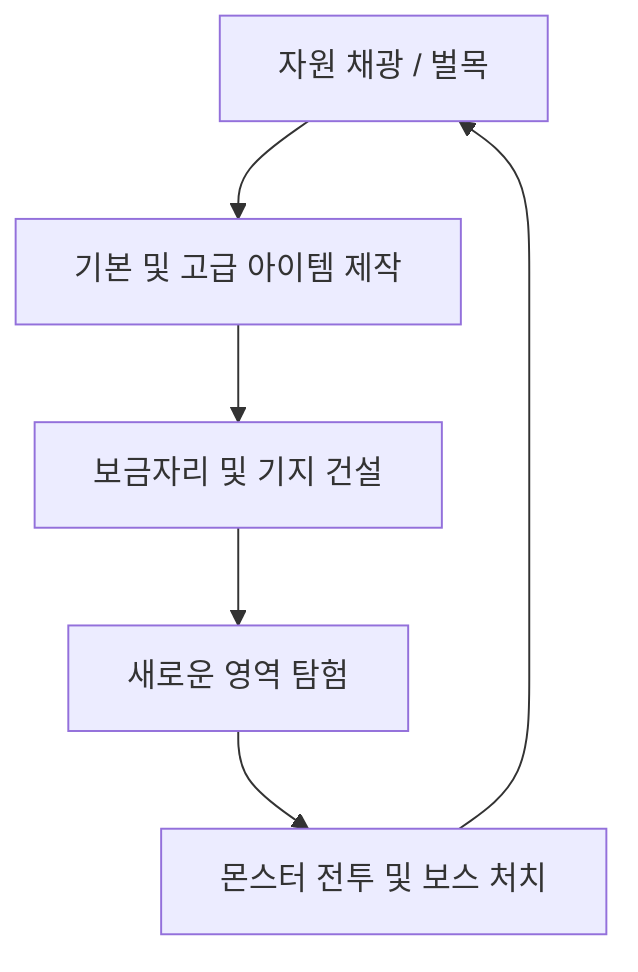

# 탑다운 크래프팅 게임 기획서 & 개발 가이드 (Game Design Document)

> [!IMPORTANT]
> **이 프로젝트에서 작업을 수행하는 AI 어시스턴트는 반드시 이 문서의 [1. AI 개발 가이드라인]을 가장 먼저 읽고 핵심 규칙을 준수해야 합니다.**

---

## 1. AI 개발 가이드라인 (AI Guidelines)

### 1.1. 개발 및 작업 범위 (Scope of Work)
* **허용된 작업 영역**:
  * **스크립트 및 모형 작성**: [RootDesk/MyDesk/](file:///c:/minho/메이플월드/RootDesk/MyDesk/) 폴더 하위에서만 수행합니다.
  * **플레이어 설정**: [Global/DefaultPlayer.model](file:///c:/minho/메이플월드/Global/DefaultPlayer.model)을 직접 수정 및 설정할 수 있습니다.
  * **월드 구성**: [Global/WorldConfig.config](file:///c:/minho/메이플월드/Global/WorldConfig.config)를 수정하여 물리 및 카메라 관련 전역 값을 튜닝할 수 있습니다.
  * **맵 데이터**: `map/` 폴더 하위의 맵 파일들(예: [map01.map](file:///c:/minho/메이플월드/map/map01.map))을 수정할 수 있습니다.
* **수정 금지 영역**: 
  * **`Environment/` 폴더**: 절대 생성, 수정, 삭제하지 마십시오.
  * **자동 생성 파일**: 자동 생성되는 `.codeblock` 또는 `.d.mlua` 파일은 직접 수정하지 마십시오. (에디터 Refresh 시 자동 재생성됨)

### 1.2. 게임 물리 및 기본 조작키
* **맵 기본 설정**: 맵 [map01.map](file:///c:/minho/메이플월드/map/map01.map)은 `TileMapMode = 1` (RectTileMap, 탑다운 격자형 맵)으로 구성되어 있습니다.
* **물리 컴포넌트**: 모든 동적 엔티티(플레이어, 몬스터)는 중력이 없는 **`KinematicbodyComponent`**를 바디 컴포넌트로 사용해야 합니다.
* **조작 키 기본값 (메이플스토리 조작키 기반)**:
  * **이동**: 방향키 (Arrow Keys - Left, Right, Up, Down)로 4방향 이동.
  - **점프 (비주얼 점프)**: Alt 키. (RectTile 모드이므로 물리적 높이 변화 없는 비주얼 점프)
  - **공격 / 채광**: Ctrl 키. (바라보는 방향의 인접 타일 또는 몬스터 타격)

### 1.3. MSW-MCP 연동 및 검증 프로세스
* 에디터 제어 및 로그 모니터링은 **`msw-maker-mcp`**를 활용하십시오.
* **필수 툴 체인**:
  * `refresh`: 파일 변경 사항을 에디터에 동기화.
  * `play` / `stop`: 플레이 모드 시작 및 중지.
  * `clear_logs` -> `logs`: 빌드 오류 및 런타임 오류 검출.
* **RUID 유효성**: `SpriteRendererComponent` 등 생성 시, `SpriteRUID`를 비워두지 말고 적절한 리소스를 `msw-search`로 검색하여 바인딩하십시오.
* **Builder 사용**: `.map`, `.model`, `.ui` 파일을 수정할 때는 [references/builder-protocol.md](file:///c:/minho/메이플월드/plugins/msw-maker-base-skill/skills/msw-general/references/builder-protocol.md)를 숙지하고 각각의 Builder 스크립트를 사용하십시오.

### 1.4. 컴포넌트 기반 설계 가이드라인 (Component-Based Design Guidelines)
* **공통 속성 모듈화**: 자원, 몬스터, NPC 등 여러 모델에 유사하게 적용되는 특수 기능이나 데이터 속성(예: 자원의 격자 점유 영역 `ResourceOccupiedArea`)은 반드시 독립된 컴포넌트 스크립트로 정의하여 모델에 장착하고 각 모델의 프로퍼티 기본값으로 관리하십시오.
* **하드코딩 금지**: 로직 스크립트(예: Spawner 등) 내부에서 모델 이름이나 종류에 따라 좌표, 공격력, 속도 등의 수치를 분기 조건문으로 하드코딩하지 말고, 모델에 결합된 개별 컴포넌트 값을 동적으로 조회하여 처리하도록 설계해야 합니다.

---

## 2. 핵심 게임 루프 (Core Game Loop)

1. **채집 (Gathering)**: 맵 상의 다양한 타일(흙, 돌, 광석 등)과 오브젝트(나무)를 파괴하여 자원을 획득합니다.
2. **제작 (Crafting)**: 획득한 자원으로 도구(곡괭이, 도끼), 무기, 횃불, 건축용 타일 등을 제작합니다.
3. **건설 (Building)**: 타일을 설치해 벽을 세우고 방을 만들어 자신만의 기지를 구축합니다.
4. **전투 (Combat)**: 지하와 어둠 속에서 스폰되는 다양한 몬스터와 보스에 맞서 싸우고 새로운 고유 자원을 획득합니다.

---

## 3. 핵심 시스템 명세 (Core Systems Specification)

### 3.1. 플레이어 이동 및 조작
- **조작 방식**: 방향키 이동, Alt 점프, Ctrl 공격/채광.
- **물리 컴포넌트**: `KinematicbodyComponent` 사용 (중력 없음).
  - 속도 제어: `SpeedFactor` 속성을 튜닝하여 캐릭터 이동 속도 제어.
- **카메라**: 플레이어를 추적하며 격자형 맵 탐색에 용이하도록 설정.

### 3.2. 격자형 타일 인터랙션 (채광 & 설치)
- **맵 모드**: `TileMapMode = 1` (RectTileMap).
- **좌표 변환**: 
  - 마우스 클릭 위치(월드 좌표) -> 타일 셀 좌표 변환 (`ToCellPosition`)
  - 셀 좌표 -> 월드 좌표 변환 (`ToWorldPosition`)
- **블록 파괴 (Mining)**:
  - 플레이어가 사거리 내의 블록을 공격/클릭 시 타일 파괴.
  - `RectTileMapComponent:RemoveTile(cellPos)`를 호출하여 타일을 제거하고 해당 자원 아이템 스폰.
- **블록 설치 (Building)**:
  - 인벤토리에서 타일을 선택하고 빈 격자를 우클릭 시 설치.
  - `RectTileMapComponent:SetTile(tileName, cellPos)`를 통해 실시간으로 타일 배치.

### 3.3. 인벤토리 및 제작 (UI)
- **인벤토리**: 캐릭터가 획득한 자원, 무기, 소비품을 보관하는 격자형 슬롯 UI.
  - MSW의 `msw-ui-system` 기반 모듈형 UI 설계.
- **제작대 (Crafting Table)**:
  - 플레이어가 제작창을 열어 보유한 자원으로 레시피에 맞춰 아이템 제작.
  - 예: 나무 5개 -> 나무 곡괭이 제작.

### 3.4. 전투 및 몬스터 AI
- **몬스터 스폰**: 어두운 영역이나 특정 타일 근처에서 주기적으로 몬스터 스폰 (`MonsterSpawner`).
- **몬스터 AI**: `KinematicbodyComponent`를 활용한 배회 AI (`MonsterWanderAI`) 및 플레이어 추적 AI 구현.
- **전투**:
  - 플레이어가 무기를 휘둘러 피격 판정 범위 내의 몬스터에게 데미지 부여.
  - 체력(HP) 컴포넌트 및 피격 애니메이션(주황색 깜빡임 등) 적용.

---

### 3.5. 시드 기반 맵 생성 및 하이브리드 구조 (Seed-based Generation & Hybrid Structure)
- **하이브리드 맵 구조**:
  - **지형 (TileMap)**: 지반 타일(Layer 1 - `BaseEarth`) 및 풀밭 지형(Layer 2 - `BaseGrass`)은 static 타일맵으로 렌더링 성능을 최적화.
  - **상호작용 자원 (Entity)**: 나무(Wood), 석돌(Stone), 구리/철 광석(Copper/Iron Ore) 및 상자 등은 독립적인 엔티티(`Entity`)로 스폰.
  - **오브젝트 연출**: 자원 엔티티에 피격 물리 흔들림 액션, 가공 파티클 연출, 투명도 변화(플레이어가 가릴 시 Z-Sorting 처리)를 구현해 완성도 높은 타격감 제공.
- **시드 기반 절차적 월드 생성**:
  - 사용자 지정 시드 값에 대응하는 의사난수 생성기(PRNG) 구축.
  - Perlin/Simplex Noise 알고리즘을 탑재하여 시드에 따라 자연스러운 대륙 형태와 자원 밀도 맵을 100% 동일하게 복원 가능하게 제어.

---

## 4. 자원 및 제작 테크 트리 (Progression Tiers)

| 티어 | 자원명 | 필요 도구 | 주요 제작 아이템 | 특징 |
|:--:|---|---|---|---|
| **Tier 0** | **흙 (Dirt)** | 맨손 / 나무 곡괭이 | 흙벽, 기초 땅 바닥 | 가장 흔하며 쉽게 캐짐 |
| **Tier 1** | **나무 (Wood)** | 맨손 / 나무 도끼 | 제작대, 횃불, 기본 상자 | 제작의 기초가 되는 나무 재료 |
| **Tier 2** | **돌 (Stone)** | 나무 곡괭이 | 화로 (Furnace), 돌담, 돌 곡괭이 | 광물 제련을 위한 화로 제작 가능 |
| **Tier 3** | **구리 (Copper)** | 돌 곡괭이 | 구리 주괴, 구리 곡괭이, 구리 검 | 본격적인 금속 장비의 시작 |
| **Tier 4** | **철 (Iron)** | 구리 곡괭이 | 철 주괴, 철 곡괭이, 철제 장비, 철제 문 | 중반부 기지 자동화 및 강화 장비 |

---

## 5. 작업 관리 및 진행 현황 (Task Tracker)

### Phase 1: 개발 환경 및 설계 구성 (완료)
- [x] MCP 서버 연동 및 윈도우 환경 실행 에러 해결 (`/d` 플래그 적용)
- [x] 기획서(`game_design.md`) 구성 및 핵심 사양 정의
- [x] 프로젝트 파일 통합 및 AI 개발 가이드 작성
- [x] 월드 설정 확인 (`map01.map`의 RectTile 모드 동작 검증)

### Phase 2: 탑다운 이동 및 조작 고도화 (완료)
- [x] 플레이어 캐릭터 모델(`KinematicbodyComponent`) 정의 및 교체
- [x] 방향키를 이용한 4방향 정밀 이동 스크립트 작성 (클라이언트-서버 동기화)
- [x] Alt 키 입력 시 비주얼 점프 액션 구현
- [x] Ctrl 키 입력 시 Melee 공격/휘두르기 애니메이션 처리
- [x] 카메라 추적 로직 및 격자 경계선 처리

### Phase 3: 다이내믹 맵 레이아웃 & 자원 스폰 시스템 고도화 (완료)
- [x] 타일별 내구도 추적 기능 구축 (흙 1회, 돌 2회, 구리 3회 등)
- [x] 타일 파괴 시 `model://itemasset` 모델을 활용한 자원 드롭 아이템 동적 스폰
- [x] 드롭 아이템의 비주얼 점프/플로팅 애니메이션 및 플레이어 유도(자석) 효과
- [x] 플레이어 인벤토리 컴포넌트 추가 및 획득 자원 로깅
- [x] 타일셋 `tile1.tileset`에서 `Baram_47`을 `BassGrassLD2`로 리네임하여 풀밭 타일셋 세트 완성
- [x] `map01.map`에 채집 불가능한 `BaseEarth` 및 `BaseGrass` 타일들로 구성된 중앙 풀밭 섬 기둥 기초 땅 레이아웃 배치
- [x] `ResourceSpawner.mlua`에서 시작 시 기존 베이스 땅 타일 정보를 스캔/저장하고 그 위에 자원만 오버레이 스폰하도록 개선
- [x] `TileDurabilityManager.mlua`에서 자원 채광 시 원래 자리에 있던 베이스 땅 타일을 동적으로 복구하도록 고도화
- [x] 카메라 줌 아웃 비율 커스터마이징 (`ZoomRatio = 60.0` 기본값 적용)

### Phase 4: 시드 기반 맵 생성 및 하이브리드 구조 전환 (진행 예정)
- [ ] PRNG(의사난수 생성기) 스크립트 모듈 구현
- [ ] Perlin/Simplex Noise 알고리즘 기반 대형 2D 지형 맵 생성 알고리즘 연동
- [ ] 자원 타일 스폰 로직을 엔티티 스폰 및 배치 체계로 전환 (돌/구리 엔티티 생성)
- [ ] 개별 자원 엔티티에 피격 시 회전/Scale 미세 진동 흔들림 효과 컴포넌트 장착
- [ ] 플레이어 위치 주변 자원 오브젝트 청크 기반 동적 로딩 최적화 기법 도입

### Phase 5: 나무 자원 추가 및 제작 테크 트리 확장 (진행 예정)
- [ ] 나무(Wood) 자원 엔티티(벌목 가능) 스폰 및 나무 도끼 도구 레벨 매핑
- [ ] 금속 제련소(Furnace/화로) 배치 및 광석 정제 가공 제작 흐름 구현
- [ ] 테크 등급별 제작대 레시피 연동 (돌 곡괭이 -> 구리 곡괭이 -> 철 곡괭이)
- [ ] 몬스터 AI 배회 AI 연동 및 기본적인 기지 빌딩 시스템 검증
